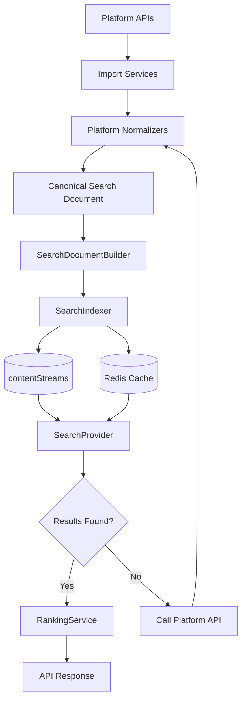
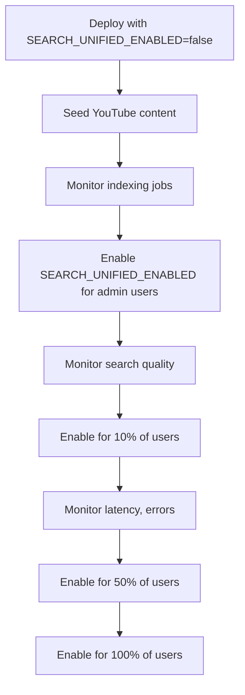

# 00 — Project Overview

Status: 🟡 In Progress
Phase: Phase 1
Owner: Architect
Last Updated: 2026-07-28
Depends On: [README](./README.md)
Next Document: [01_Current_Search_Audit](./01_Current_Search_Audit.md)

---

> **Update (2026-07-31):** the `SEARCH_UNIFIED_ENABLED` flag was removed; there
> is no gradual rollout (see [16_Feature_Flag_Rollout](./16_Feature_Flag_Rollout.md)).
> Search persistence is unconditional: every upstream provider result is written
> through `ContentStreamIndexService.indexBatch()` (upsert on
> `(platform, externalId)`), and `SearchService` orchestrates cache, DB-first
> lookup, staleness, fetch, and response building without persisting itself.

---

## 1. Purpose

This document establishes the complete scope of the Gaddr Unified Search initiative. It defines what we are building, what we are not building, the constraints we operate under, and the architecture we are targeting. Every subsequent document in this series refers back to this overview.

---

## 2. Current State

Gaddr Search performs per-platform fan-out on every user search request. When a user types a query, the system simultaneously invokes platform-specific search methods — YouTube `search.list`, Facebook Graph API, Instagram Graph API, Pinterest search, and others — merges the results, and returns a unified response.

This works but creates several compounding problems:

- **Quota exhaustion:** YouTube allows only 100 `search.list` calls per day. Each user search on YouTube costs 100 units from a 10,000 daily quota. Under moderate load, this quota is depleted within hours.
- **Latency:** Fan-out to 12 platform APIs means the slowest API dictates the overall response time. A single slow or failing platform delays the entire search.
- **Inconsistent result shapes:** Each platform returns different fields. Normalization happens at response time, producing inconsistent ranking signals and making unified ranking impossible.
- **No control over freshness:** Search results are only as fresh as the last API call. No background indexing, no content caching, no refresh strategy.
- **Monolithic service:** The `SearchService` is a 3,151-line file with 12 platform-specific search methods, each with its own query construction, error handling, and result normalization. This is not maintainable.

---

## 3. Target State

Gaddr Unified Search replaces fan-out with a three-tier search retrieval strategy: Redis Cache → PostgreSQL contentStreams → External Platform APIs. All content from all platforms is imported, normalized, and indexed into `contentStreams` as Canonical Search Documents. At query time, the system checks Redis first, then PostgreSQL, then calls external APIs only if both miss.

**Three-Tier Retrieval Strategy:**

1. **Redis Cache (fastest)** — Check Redis for cached search responses
2. **PostgreSQL contentStreams** — If Redis misses, search the canonical corpus
3. **External Platform APIs** — Only called when both Redis and PostgreSQL miss

The target state preserves the existing API contract. Frontend code requires no changes during Phase 1 rollout. The feature flag `SEARCH_UNIFIED_ENABLED` allows gradual migration.

---

## 4. Scope

### Phase 1 — YouTube + Architecture

Phase 1 implements the complete architecture with YouTube as the first platform. This establishes the pattern for all subsequent platforms.

**Included in Phase 1:**

- SearchQueryPipeline — full query lifecycle with cache-miss fallback
- SearchProvider — PostgreSQL implementation of the search interface
- SearchDocumentBuilder — searchText generation and text cleaning
- SearchIndexer — contentStreams persistence
- RankingService — text relevance, engagement, freshness, creator authority
- contentStreams extension — new columns for search indexing
- YouTube normalizer — YouTube API response to Canonical Search Document
- YouTube import pipeline — import events trigger search indexing
- Background enrichment — videos.list enrichment for missing metadata
- On-demand indexing — cache miss triggers platform API call and indexing
- Lazy refresh — stale content refreshed only when searched again
- Search API refactor — feature-flagged routing to new pipeline
- Feature flag — `SEARCH_UNIFIED_ENABLED` for gradual rollout
- Unit, integration, and E2E tests

**Not included in Phase 1:**

- Facebook, Instagram, Pinterest, or any other platform
- Meilisearch integration
- AI-powered features (semantic search, embeddings, OCR, transcripts)
- Personalized ranking or recommendations
- Real-time webhook indexing

### Phase 2 — Additional Platforms

Facebook, Instagram, and Pinterest implementations following the Phase 1 pattern. Each platform gets a normalizer, background enrichment, and background refresh. No architectural changes required.

### Phase 3 — Search Engine Migration

Meilisearch replaces PostgreSQL as the search engine. The SearchProvider interface abstracts the implementation. Callers do not change.

### Phase 4 — AI and Advanced Search

Semantic search, embeddings, vision-based OCR, speech transcription, and machine learning ranking. These features build on the searchText field and metadata JSONB column established in Phase 1.

---

## 5. Architecture Principles

| Principle | Description |
|---|---|
| Single Responsibility | Each component does one thing. Normalizers normalize. Builders build. Indexers index. Rankers rank. |
| Three-Tier Retrieval | Redis → PostgreSQL → Platform API. Fastest path first. |
| Redis as Performance Cache | Redis caches search responses for sub-5ms retrieval. PostgreSQL remains source of truth. |
| On-Demand Indexing | New content enters the corpus through real user demand. Cache miss triggers platform API call, normalization, and indexing. |
| Lazy Refresh | Content is refreshed only when searched and stale. No scheduled polling or periodic API synchronization. |
| Incremental Migrations | All schema changes are additive. New columns are nullable. Old code continues to work. |
| Idempotent Indexing | Indexing the same document twice produces the same result. No duplicates, no conflicts. |
| Feature Flags | New search implementation runs behind a feature flag. Old and new coexist during rollout. |
| Backward Compatibility | The existing API contract is preserved. Frontend requires no changes. |
| Infrastructure-Aware Design | Every decision accounts for 512 MB RAM, 0.1 vCPU, and 30 Redis connections. |

---

## 6. Infrastructure Constraints

| Resource | Limit | Consequence |
|---|---|---|
| Cloud Run RAM | 512 MB | No additional search services in Phase 1 |
| Cloud Run vCPU | 0.1 | Prefer async indexing, avoid synchronous heavy computation |
| Redis | 30 MB, 30 connections | Cache only search responses, not entire indexes; reuse existing shared client |
| PostgreSQL | Source of truth | Search corpus stored in contentStreams; FTS and GIN indexes |
| YouTube API | 100 `search.list` queries/day | On-demand indexing for cache miss only; never search live for indexed content |
| Cloudflare R2 | 10 GB | Media goes to R2, not container filesystem |
| BullMQ | Concurrency 1-2 per worker | Indexing must not block other background workers |

---

## 7. Search Ranking Formula

The initial ranking formula combines four signals with fixed weights:

| Signal | Weight | Source |
|---|---|---|
| Text relevance | 0.40 | ts_rank + similarity from contentStreams |
| Engagement | 0.25 | View count, likes, comments from metaData |
| Freshness | 0.20 | publishedAt decay from contentStreams |
| Creator authority | 0.10 | Subscriber count from metaData |

Platform-specific weights may be added in Phase 2 when platform normalization is established.

---

## 8. Deployment Strategy

The feature flag allows gradual rollout with immediate rollback capability. Each stage includes monitoring gates before proceeding.

---

## 9. Rollback Strategy

If the new search pipeline fails or produces poor results:

1. Set `SEARCH_UNIFIED_ENABLED=false` in environment variables
2. The system reverts to the existing per-platform fan-out search
3. No data loss — all indexed content remains in contentStreams
4. No code deployment required — configuration change only
5. Rollback completes in under 60 seconds (Cloud Run service restart)

---

## 10. Testing Strategy

| Test Type | Purpose | Scope |
|---|---|---|
| Unit | Verify SearchProvider, SearchDocumentBuilder, Normalizers in isolation | Individual functions |
| Integration | Verify PostgreSQL search queries, BullMQ job processing | Database + queue |
| E2E | Verify full search pipeline from API request to response | API + database + queue |
| Load | Verify latency under production-like traffic | Full system |
| Regression | Verify existing search behavior is preserved during rollout | API contract |

---

## 11. Risk Assessment

| Risk | Impact | Likelihood | Mitigation |
|---|---|---|---|
| PostgreSQL FTS performance under load | High | Low | GIN indexes, query optimization, load testing |
| YouTube quota exhaustion during import | High | Medium | Import throttling, quota monitoring, daily limits |
| contentStreams table bloat | Medium | Medium | TTL on documents, background cleanup, monitoring |
| Feature flag misconfiguration | High | Low | Validation in deployment pipeline, canary rollout |
| BullMQ job backlog | Medium | Medium | Queue monitoring, dead letter queues, retry limits |
| Redis connection exhaustion | High | Low | Connection pooling, reuse existing client |

---

## 12. Success Metrics

| Metric | Target | Measurement |
|---|---|---|
| Search latency (p50) | < 100ms | Application metrics |
| Search latency (p99) | < 300ms | Application metrics |
| YouTube quota usage | < 10% of daily limit | YouTube API dashboard |
| Index freshness | < 24 hours | Background job monitoring |
| Search result relevance | Qualitative assessment | Manual review, user feedback |
| API contract compatibility | 100% | E2E test suite |
| Zero downtime during rollout | 100% | Deployment monitoring |

---

## 13. Related Documents

- [README](./README.md) — Entry point and architecture summary
- [01_Current_Search_Audit](./01_Current_Search_Audit.md) — Detailed audit of current search implementation
- [02_Architecture](./02_Architecture.md) — Complete architecture diagrams
- [15_Search_API_Refactor](./15_Search_API_Refactor.md) — API contract preservation
- [16_Feature_Flag_Rollout](./16_Feature_Flag_Rollout.md) — Feature flag strategy
