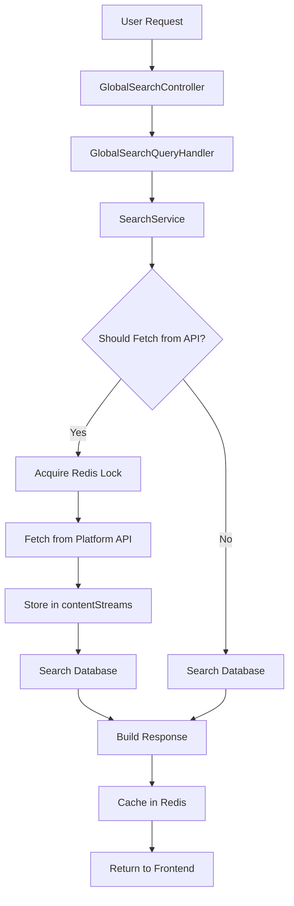

# 01 — Current Search Audit

Status: 🟡 In Progress
Phase: Phase 1
Owner: Architect
Last Updated: 2026-07-28
Depends On: [00_Overview](./00_Overview.md)
Next Document: [02_Architecture](./02_Architecture.md)

---

## 1. Executive Summary

The current Gaddr Search implementation is a monolithic service with 3,151 lines of code containing 12 platform-specific search methods, each performing per-platform fan-out to external APIs on every user request. This audit documents the complete architecture, identifies performance bottlenecks, and establishes the baseline against which the unified search system will be measured.

**Key findings:**

- The `SearchService` contains 12 platform-specific search methods (YouTube, Facebook, Instagram, Pinterest, Reddit, Spotify, Twitter, LinkedIn, TikTok, Snapchat, Threads, Behance)
- Every user search fans out to multiple platform APIs in parallel via `Promise.all`
- YouTube `search.list` costs 100 of 10,000 daily quota units — exhausted within hours under moderate load
- PostgreSQL search uses `ILIKE` with `json_each_text` full table scan — no GIN indexes on `contentStreams`
- Redis caching uses MD5-based keys with lock mechanisms — effective but adds complexity
- Two separate search systems exist: platform fan-out (primary) and database-only search (suggestions/results)
- The `SearchService` mixes concerns: API calls, database queries, caching, locking, and response building

---

## 2. Current Search Flow



The search flow has two paths:

1. **Cache hit path:** Check Redis cache → return cached results if available
2. **Cache miss path:** Check database → if stale/empty, fetch from platform API → store in contentStreams → search database → cache results → return

---

## 3. Entry Points

### REST Controller

**File:** `src/features/search/search.endpoint.ts` (74 lines)

| Route | Method | Handler | Description |
|---|---|---|---|
| `/api/v1/search` | POST | `GlobalSearch` | Fan-out search across all platforms |
| `/api/v1/search/suggestions` | GET | `suggestions` | Autocomplete suggestions (DB only) |
| `/api/v1/search/results` | GET | `results` | Search results from DB only |
| `/api/v1/search/item` | GET | `item` | Single item by ID from DB |

### Query Handlers

**File:** `src/features/search/search.handler.ts` (527 lines)

- `GlobalSearchQueryHandler` — Handles the POST `/search` endpoint
  - Normalizes search query using `fuseUtil.normalizeSearchTerm`
  - Retrieves user's linked platform accounts and access tokens
  - Fans out to all requested platforms in parallel via `Promise.all`
  - Each platform call goes through `SearchService.search{Platform}Async`
  - Merges results into `GlobalSearchResponseModel`
  - Tracks search analytics via `IAnalyticsService`

**File:** `src/features/search/database-search.handler.ts` (308 lines)

- `SearchSuggestionsQueryHandler` — Autocomplete from `users` and `userContents` tables
- `SearchResultsQueryHandler` — Paginated results from `users` and `userContents` tables
- `SearchItemQueryHandler` — Single item fetch by ID

> **Important**
>
> The database-only search (suggestions/results/item) is a separate system from the platform fan-out search. They share no code. The unified search system will replace both.

---

## 4. SearchService Architecture

**File:** `src/infrastructure/services/search.service.ts` (3,151 lines)

The `SearchService` is the monolithic core of the current search implementation. It implements `ISearchService` and contains:

### Platform-Specific Search Methods

| Method | Lines | External API | Cache Key Pattern |
|---|---|---|---|
| `searchFacebookAsync` | 117-215 | Facebook Graph API | `facebook:search:{query}:{filtersHash}:{page}:{limit}` |
| `searchInstagramAsync` | 376-480 | Instagram Graph API | `instagram:search:{query}:{filtersHash}:{page}:{limit}` |
| `searchYoutubeAsync` | 978-1089 | YouTube Data API v3 | `youtube:search:{query}:{filtersHash}:{page}:{limit}` |
| `searchRedditAsync` | 1578-1680 | Reddit API | `reddit:search:{query}:{filtersHash}:{page}:{limit}` |
| `searchSpotifyAsync` | 2100-2200 | Spotify Web API | `spotify:search:{query}:{filtersHash}:{page}:{limit}` |
| `searchPinterestAsync` | 2500-2600 | Pinterest API | `pinterest:search:{query}:{filtersHash}:{page}:{limit}` |
| `searchTiktokAsync` | 2700-2800 | TikTok API | `tiktok:search:{query}:{filtersHash}:{page}:{limit}` |
| `searchTwitterAsync` | 1900-2000 | Twitter API | `twitter:search:{query}:{filtersHash}:{page}:{limit}` |
| `searchLinkedInAsync` | 2300-2400 | LinkedIn API | `linkedin:search:{query}:{filtersHash}:{page}:{limit}` |
| `searchSnapchatAsync` | 2900-3000 | Snapchat API | `snapchat:search:{query}:{filtersHash}:{page}:{limit}` |
| `searchThreadsAsync` | 3000-3100 | Threads API | `threads:search:{query}:{filtersHash}:{page}:{limit}` |
| `searchBehanceAsync` | 3100-3151 | Behance API | `behance:search:{query}:{filtersHash}:{page}:{limit}` |

### Common Pattern Across All Platforms

Every platform search method follows the same pattern:

```mermaid
graph TD
    A[search{Platform}Async] --> B[Check Redis Cache]
    B --> |Hit| C[Return Cached Results]
    B --> |Miss| D[Calculate Section Limits]
    D --> E[Search Database in Parallel]
    E --> F{Should Fetch from API?}
    F --> |Yes| G[Acquire Lock]
    F --> |No| H[Build Response]
    G --> |Acquired| I[Fetch from Platform API]
    G --> |Not Acquired| J[Wait for Cached Results]
    I --> K[Store in Database]
    K --> L[Search Database Again]
    L --> M[Build Response]
    J --> N[Return Waited Results]
    H --> O[Cache Results]
    O --> P[Return Response]
```

### Shared Helper Methods

| Method | Purpose |
|---|---|
| `getDatabaseResults` | Queries `contentStreams`, `userContents`, `linkedAccounts` in parallel |
| `shouldFetchFromAPI` | Decision logic: forceRefresh, page>1, staleness threshold (30%), result count |
| `getDatabaseStalenessInfo` | Calculates stale percentage based on `lastRefreshed` vs `SEARCH_CACHE.RESULT_FRESHNESS_WINDOW_MS` |
| `updateContentRefreshTimestamp` | Updates `lastRefreshed` for existing content — **removed from SearchService (2026-07-31)**; refresh is now implicit in the `ContentStreamIndexService` upsert on `(platform, externalId)` |
| `searchContentStreamAsync` | Delegates to `contentStreamRepository.getEntriesAsync` |
| `searchUserContentAsync` | Delegates to `userContentRepository.getEntriesAsync` |
| `searchLinkedAccountAsync` | Delegates to `linkedAccountRepository.getEntriesAsync` |

### Cache Lock Mechanism

The `SearchCacheService` (`src/infrastructure/services/searchCache.service.ts`, 133 lines) implements a distributed lock pattern:

1. Check Redis cache for existing results
2. If cache miss, acquire lock via `SET key NX EX ttl`
3. If lock acquired: fetch from API, store in DB, cache results, release lock
4. If lock not acquired: poll Redis for cached results (200ms intervals, 5s timeout)
5. This prevents thundering herd and duplicate API calls

> **Important**
>
> The lock mechanism is essential because multiple concurrent requests for the same query would otherwise all hit the platform API simultaneously, wasting quota.

---

## 5. Database Search Pattern

### contentStreams Repository

**File:** `src/infrastructure/repositories/contentStream.repository.ts` (115 lines)

The current search query against `contentStreams` uses `ILIKE` with `json_each_text`:

```sql
SELECT *
FROM contentStream cs
WHERE (
  cs.title ILIKE :searchQuery
  OR EXISTS (
    SELECT 1
    FROM json_each_text(cs.metaData) AS kv(key, value)
    WHERE value ILIKE :searchQuery
  )
)
ORDER BY
  CASE WHEN cs.title ILIKE :exactSearch THEN 0
       WHEN cs.title ILIKE :searchQuery THEN 1
       ELSE 2 END,
  cs.title ASC
```

**Performance characteristics:**

- `ILIKE` with `%` prefix requires full table scan — no index usage
- `json_each_text` scans every key-value pair in the `metaData` JSONB column
- No GIN index on `contentStreams.metaData`
- No `tsvector` or `to_tsvector` usage — no PostgreSQL full-text search
- No `pg_trgm` trigram similarity — no fuzzy matching

**Index audit:**

| Table | Index | Type | Columns |
|---|---|---|---|
| `users` | `IDX_users_search` | GIN (pg_trgm) | `to_tsvector('english', firstName \|\| ' ' \|\| lastName \|\| ' ' \|\| userName)` |
| `userContents` | `IDX_userContents_search` | GIN (pg_trgm) | `to_tsvector('english', title \|\| ' ' \|\| text)` |
| `contentStreams` | **None** | — | — |

> **Important**
>
> The `contentStreams` table has no GIN index for search. Every search query against this table performs a sequential scan. This is the primary performance bottleneck for the unified search system.

### userContents Repository

**File:** `src/infrastructure/repositories/userContent.repository.ts`

Uses the same `ILIKE` + `json_each_text` pattern as `contentStreams`. Has a GIN index on `to_tsvector` but the search query does not use it — it uses `ILIKE` instead.

### linkedAccounts Repository

**File:** `src/infrastructure/repositories/linkedAccount.repository.ts`

Uses the same `ILIKE` + `json_each_text` pattern. No GIN index.

---

## 6. YouTube Search Specifics

### YouTube API Call

**File:** `src/infrastructure/services/search.service.ts:1366-1434`

The YouTube search calls `https://www.googleapis.com/youtube/v3/search` with:

- `part: 'snippet'`
- `q: query`
- `maxResults: Math.min(Math.max(limit, 1), 50)`
- `type: 'video,channel,playlist'`
- Uses `configs.youtube.apiKey` when no access token is provided

**Quota impact:**

- Each `search.list` call costs 100 quota units
- Daily quota: 10,000 units
- Maximum 100 searches per day with no token
- With user token, quota is shared across all users

### YouTube Content Mapping

When YouTube results are fetched, they are mapped to `ContentStream` objects:

| YouTube Field | ContentStream Field |
|---|---|
| `item.id.kind` | `type` (Profile/Content) |
| `item.id.videoId/channelId/playlistId` | `externalId` |
| `item.snippet.title` | `title` |
| `item.snippet.description` | `metaData.description` |
| `item.snippet.publishedAt` | `metaData.publishedAt` |
| `item.snippet.thumbnails` | `metaData.thumbnails` |
| `item.snippet.channelId` | `metaData.channelId` |
| `item.snippet.channelTitle` | `metaData.channelTitle` |

> **Important**
>
> YouTube search results stored in `contentStreams` do not include `viewCount`, `likeCount`, `commentCount`, or `duration`. These require a separate `videos.list` call (1 unit per call) during background enrichment.

---

## 7. Response Building

Each platform has a dedicated `build{Platform}Response` method that transforms database results into platform-specific response models:

| Method | Input | Output |
|---|---|---|
| `buildYoutubeResponse` | `contentStreams[]`, `userContents[]` | `YoutubeSearchResponseModel` |
| `buildFacebookResponse` | `contentStreams[]`, `userContents[]`, `linkedAccounts[]` | `FacebookSearchResponseModel` |
| `buildRedditResponse` | `contentStreams[]`, `userContents[]`, `linkedAccounts[]` | `RedditSearchResponseModel` |

The response models are platform-specific — each has different field names and structures. The frontend consumes these models directly.

---

## 8. Feature Flag Infrastructure

The existing codebase has a `SEARCH_UNIFIED_ENABLED` feature flag pattern but it is not yet implemented. The current search is always-on with no fallback mechanism.

**Current behavior:**

- All platforms are always searched
- No per-platform toggle
- No percentage-based rollout
- No admin-only mode

---

## 9. Performance Characteristics

### Latency Breakdown

| Component | Latency | Source |
|---|---|---|
| Query normalization | ~5ms | `fuseUtil.normalizeSearchTerm` |
| Database search | ~20-100ms | `ILIKE` + `json_each_text` sequential scan |
| Platform API call | ~200-2000ms | External HTTP request |
| Redis cache lookup | ~1-5ms | Redis GET |
| Redis lock acquisition | ~1-5ms | Redis SET NX |
| Response building | ~1-5ms | In-memory transformation |
| **Total (cache hit)** | **~10-20ms** | — |
| **Total (cache miss)** | **~200-2000ms** | Bounded by slowest platform |

### Memory Usage

The `SearchService` loads all platform models, mappers, and constants into memory. With 12 platform imports, this is significant but within the 512 MB Cloud Run limit.

### Database Load

Every search query triggers 3 parallel database queries:

1. `contentStreams` — `ILIKE` + `json_each_text` sequential scan
2. `userContents` — `ILIKE` + `json_each_text` sequential scan
3. `linkedAccounts` — `ILIKE` + `json_each_text` sequential scan

With no GIN indexes on `contentStreams`, this is O(n) per query where n is the total number of rows.

---

## 10. Issues Identified

| ID | Issue | Severity | Impact |
|---|---|---|---|
| S1 | `contentStreams` has no GIN index for search | High | Sequential scan on every query |
| S2 | Search queries use `ILIKE` instead of `tsvector`/`ts_rank` | High | No use of PostgreSQL FTS capabilities |
| S3 | `json_each_text` used for metadata search without GIN index | High | Full JSONB scan per query |
| S4 | YouTube `search.list` called during user requests | Critical | Quota exhaustion within hours |
| S5 | Monolithic `SearchService` (3,151 lines) | Medium | Maintainability, testability |
| S6 | Platform-specific response models tightly couple frontend to backend | Medium | Cannot change response shape without frontend changes |
| S7 | No unified ranking across platforms | Medium | Results ordered by platform, not relevance |
| S8 | Cache lock mechanism adds complexity | Low | Acceptable for current scale |
| S9 | `SEARCH_UNIFIED_ENABLED` flag not implemented | Low | No gradual rollout capability |
| S10 | Two separate search systems (fan-out + DB-only) | Medium | Inconsistent behavior, duplicated logic |

---

## 11. Recommendations

1. **Add GIN index on `contentStreams`** — Add `to_tsvector('english', title || ' ' || coalesce(metaData->>'description', ''))` GIN index
2. **Implement `tsvector`/`ts_rank`** — Replace `ILIKE` with PostgreSQL full-text search
3. **Add `searchText` column** — Pre-computed search text to avoid runtime concatenation
4. **Implement `SearchProvider` interface** — Abstract search implementation for future Meilisearch migration
5. **Remove YouTube `search.list` from search path** — Only call during import/refresh
6. **Decompose `SearchService`** — Split into `SearchProvider`, `SearchIndexer`, `RankingService`

---

## 12. Related Documents

- [README](./README.md) — Entry point and architecture summary
- [00_Overview](./00_Overview.md) — Project overview
- [02_Architecture](./02_Architecture.md) — Target architecture
- [05_Search_Provider](./05_Search_Provider.md) — SearchProvider interface
- [09_ContentStreams_Extension](./09_ContentStreams_Extension.md) — Schema changes
- [10_Postgres_Search](./10_Postgres_Search.md) — PostgreSQL FTS implementation
