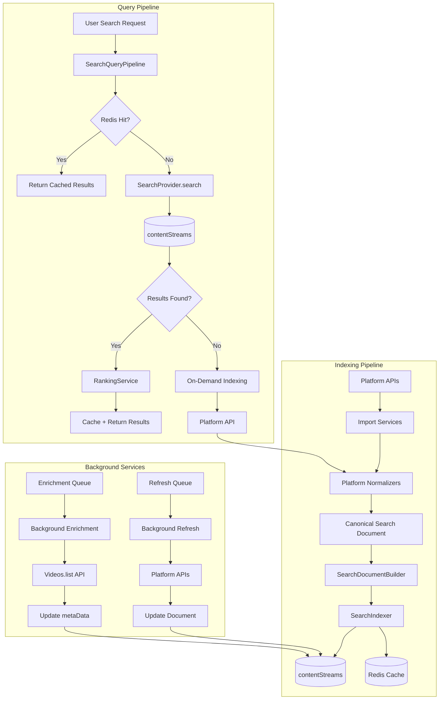
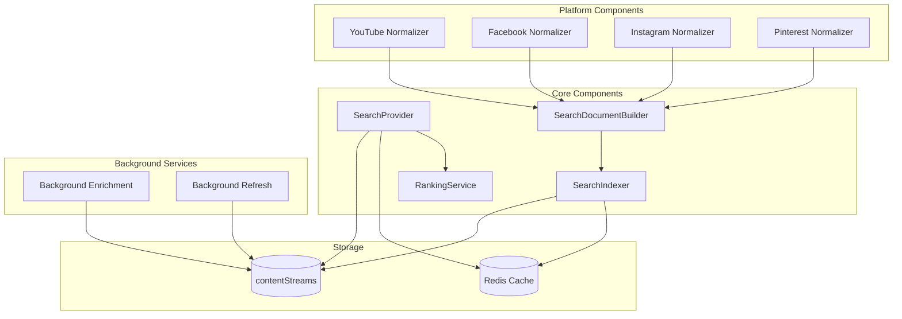
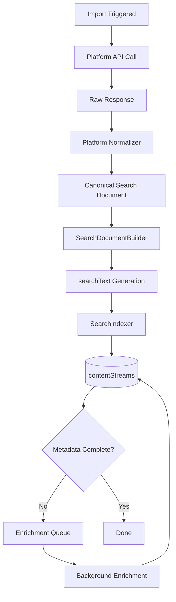
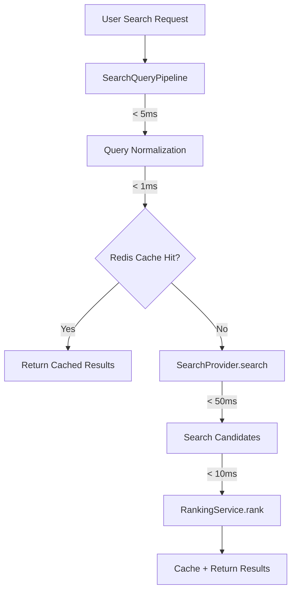
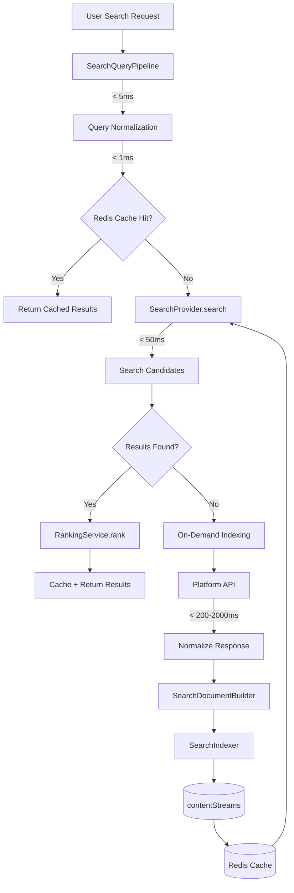
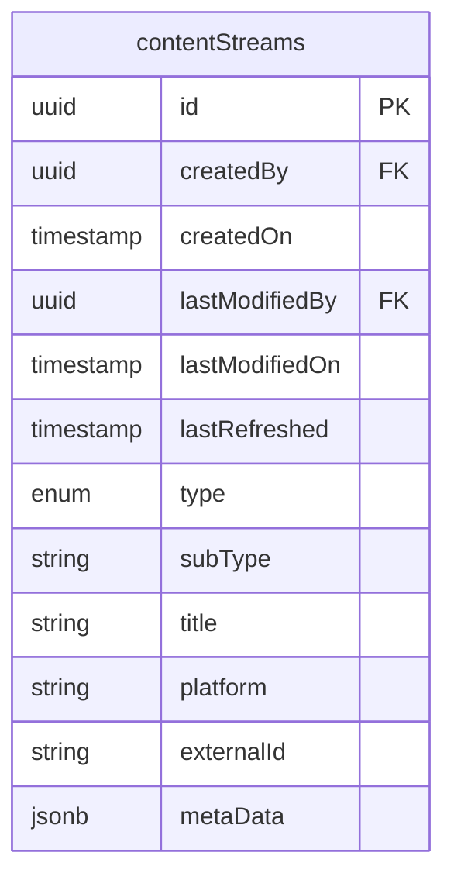
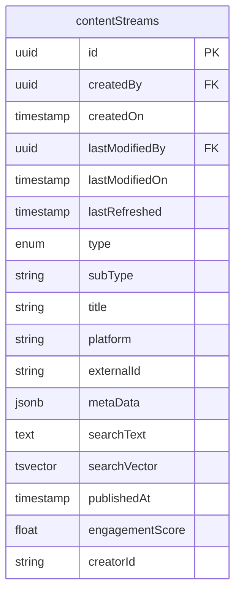
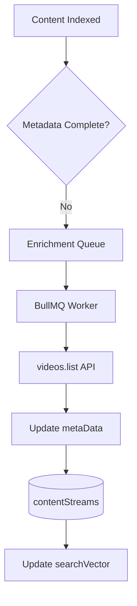
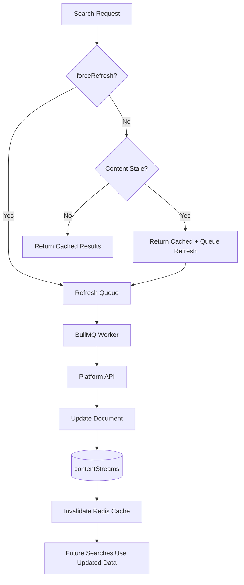
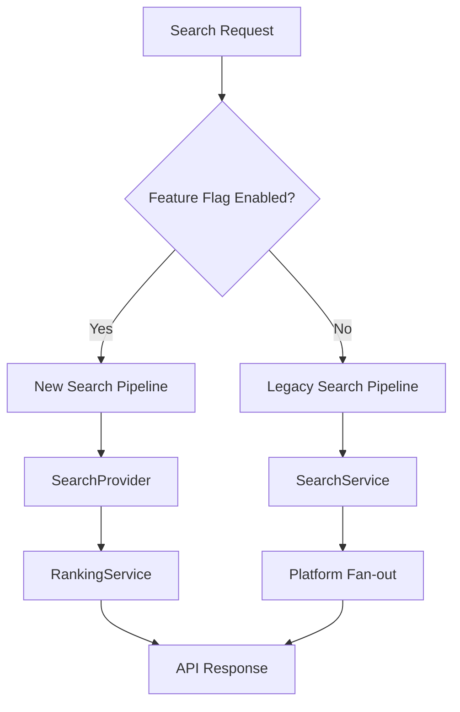

# 02 — Architecture

Status: 🟡 In Progress
Phase: Phase 1
Owner: Architect
Last Updated: 2026-07-28
Depends On: [00_Overview](./00_Overview.md), [01_Current_Search_Audit](./01_Current_Search_Audit.md)
Next Document: [03_Search_Domain_Model](./03_Search_Domain_Model.md)

---

> **Update (2026-07-31):** feature-flag routing described below is historical.
> `SEARCH_UNIFIED_ENABLED` was removed from `src/core/utils/const.ts` and no
> longer exists anywhere in `src`. The indexer is the single write path:
> `ContentStreamIndexService.indexBatch()` upserts all upstream provider results
> into `contentStreams` on `(platform, externalId)`. `SearchService` retains its
> orchestration role (cache coordination, DB-first lookup, staleness, fetch,
> response building) with no persistence of its own.

---

## 1. Executive Summary

This document defines the complete target architecture for Gaddr Unified Search. It replaces the monolithic `SearchService` (3,151 lines) with a modular system of six components: SearchProvider, SearchDocumentBuilder, SearchIndexer, RankingService, Platform Normalizer, and Background Enrichment/Refresh.

The architecture is designed to operate within existing infrastructure constraints (512 MB RAM, 0.1 vCPU, 30 MB Redis, PostgreSQL as search engine) while remaining extensible for future search engine migration (Meilisearch) and AI-powered features (semantic search, embeddings, OCR).

---

## 2. Architecture Principles

| Principle | Description |
|---|---|
| Single Responsibility | Each component does one thing. Normalizers normalize. Builders build. Indexers index. Rankers rank. |
| Three-Tier Retrieval | Redis → PostgreSQL → Platform API. Fastest path first. |
| Redis as Performance Cache | Redis caches search responses for sub-5ms retrieval. PostgreSQL remains source of truth. |
| On-Demand Indexing | New content enters the corpus through real user demand. Cache miss triggers platform API call, normalization, and indexing. |
| Lazy Refresh | Content is refreshed only when searched and stale. No scheduled polling or periodic API synchronization. |
| Incremental Migrations | All schema changes are additive. New columns are nullable. Old code continues to work. |
| Idempotent Indexing | Indexing the same document twice produces the same result. No duplicates, no conflicts. |
| Feature Flags | New search implementation runs behind a feature flag. Old and new coexist during rollout. |
| Backward Compatibility | The existing API contract is preserved. Frontend requires no changes. |
| Infrastructure-Aware Design | Every decision accounts for 512 MB RAM, 0.1 vCPU, and 30 Redis connections. |

---

## 3. High-Level Architecture

### 3.1 Search Data Retrieval Strategy

The unified search system is a **three-tier retrieval strategy**: Redis Cache → PostgreSQL contentStreams → External Platform APIs. Searching must NEVER immediately call external platform APIs unless BOTH Redis and PostgreSQL have no matching content.

**Three-Tier Retrieval Strategy:**

1. **Redis Cache (fastest)** — Check Redis for cached search responses (< 5ms)
2. **PostgreSQL contentStreams** — If Redis misses, search the canonical corpus (< 50ms)
3. **External Platform APIs** — Only called when both Redis and PostgreSQL miss

### 3.2 System Architecture



---

## 4. Component Architecture



---

## 5. Indexing Pipeline

The indexing pipeline transforms raw platform API responses into searchable documents in `contentStreams`.

### 5.1 Pipeline Flow



### 5.2 Component Responsibilities

| Component | Input | Output | Responsibility |
|---|---|---|---|
| Import Service | Platform API response | Raw data | Fetch content from platform APIs |
| Platform Normalizer | Raw data | Canonical Search Document | Map platform-specific fields to normalized schema |
| SearchDocumentBuilder | Canonical Search Document | Indexed document | Generate searchText, clean text, prepare for indexing |
| SearchIndexer | Indexed document | contentStreams row | Persist to database, handle upserts |

### 5.3 Platform Normalizer

Each platform has a normalizer that maps API-specific responses to Canonical Search Documents:

| Platform | Normalizer | Source | Target |
|---|---|---|---|
| YouTube | `youtubeNormalizer.ts` | YouTube Data API v3 | Canonical Search Document |
| Facebook | `facebookNormalizer.ts` | Facebook Graph API | Canonical Search Document |
| Instagram | `instagramNormalizer.ts` | Instagram Graph API | Canonical Search Document |
| Pinterest | `pinterestNormalizer.ts` | Pinterest API | Canonical Search Document |

The normalizer is responsible for:

1. Mapping platform-specific field names to canonical names
2. Extracting engagement metrics (view count, likes, comments)
3. Extracting creator information (name, subscriber count)
4. Setting the correct `type` (Profile/Content/Community) and `subType`

### 5.4 SearchDocumentBuilder

**File:** `src/infrastructure/search/searchDocumentBuilder.ts`

The SearchDocumentBuilder generates the `searchText` field and prepares the document for indexing:

1. Concatenate title + description + tags + creatorName
2. Clean text (remove special characters, normalize whitespace)
3. Generate `tsvector` for PostgreSQL full-text search
4. Set `publishedAt` from platform-specific date fields
5. Calculate engagement score from metrics

### 5.5 SearchIndexer

**File:** `src/infrastructure/search/searchIndexer.ts`

The SearchIndexer persists documents into `contentStreams`:

1. Check if document exists (by `platform` + `externalId`)
2. If exists: update `title`, `searchText`, `metaData`, `lastRefreshed`
3. If not exists: insert new row
4. Emit `ContentIndexedEvent` for downstream consumers

---

## 6. Query Pipeline

The query pipeline transforms a user search request into ranked results. The pipeline includes a three-tier retrieval strategy: Redis Cache → PostgreSQL → Platform API (on-demand indexing).

### 6.1 Redis Cache Hit Pipeline Flow



### 6.2 PostgreSQL Hit Pipeline Flow



> **Important**
>
> Cache miss API calls must be non-blocking. If the platform API is slow or unavailable, return partial results or an empty result set. Never block the entire search pipeline waiting for a single platform.

### 6.2 Component Responsibilities

| Component | Input | Output | Responsibility |
|---|---|---|---|
| SearchQueryPipeline | User request | Normalized query | Tokenize, stop words, normalization |
| SearchProvider | Normalized query | Search Candidates | Search contentStreams, return results |
| RankingService | Search Candidates | Ranked results | Score, sort, apply business rules |

### 6.3 SearchProvider

**File:** `src/infrastructure/search/searchProvider.ts`

The SearchProvider abstracts the search engine implementation:

```typescript
interface ISearchProvider {
  search(query: SearchQuery): Promise<SearchCandidate[]>;
  index(document: SearchDocument): Promise<void>;
  update(document: SearchDocument): Promise<void>;
  delete(platform: string, externalId: string): Promise<void>;
}
```

**Phase 1 implementation:** `PostgresSearchProvider` using `tsvector` + `ts_rank` + `pg_trgm`

**Future implementation:** `MeilisearchSearchProvider` (drop-in replacement)

### 6.4 RankingService

**File:** `src/infrastructure/search/rankingService.ts`

The RankingService scores and orders search candidates:

| Signal | Weight | Source |
|---|---|---|
| Text relevance | 0.40 | `ts_rank` + `similarity` from contentStreams |
| Engagement | 0.25 | View count, likes, comments from metaData |
| Freshness | 0.20 | publishedAt decay function |
| Creator authority | 0.10 | Subscriber count from metaData |

---

## 7. Data Model

### 7.1 Current Schema



### 7.2 Extended Schema



New columns:

| Column | Type | Nullable | Purpose |
|---|---|---|---|
| `searchText` | text | yes | Pre-computed search text (title + description + tags + creatorName) |
| `searchVector` | tsvector | yes | PostgreSQL full-text search vector |
| `publishedAt` | timestamp | yes | Content publication date (extracted from metaData) |
| `engagementScore` | float | yes | Pre-computed engagement metric |
| `creatorId` | string | yes | Creator identifier for authority ranking |

---

## 8. Search Query Flow

### 8.1 Full-Text Search Query

```sql
SELECT cs.*,
       ts_rank(cs.searchVector, to_tsquery('english', :query)) AS rank,
       similarity(cs.searchText, :query) AS sim
FROM contentStreams cs
WHERE cs.searchVector @@ to_tsquery('english', :query)
   OR cs.searchText % :query
ORDER BY rank DESC, sim DESC
LIMIT :limit OFFSET :offset
```

### 8.2 Query Optimization

| Optimization | Description |
|---|---|
| GIN Index | `CREATE INDEX idx_contentStreams_search ON contentStreams USING GIN(searchVector)` |
| Trigram Index | `CREATE INDEX idx_contentStreams_trgm ON contentStreams USING GIN(searchText gin_trgm_ops)` |
| Partial Index | `CREATE INDEX idx_contentStreams_platform ON contentStreams(platform) WHERE searchVector IS NOT NULL` |
| Materialized Rank | Pre-compute `engagementScore` at index time, not query time |

---

## 9. Background Services

### 9.1 Background Enrichment



**Purpose:** Add detailed metadata (view count, duration, tags) to indexed documents after initial import.

**Trigger:** After initial indexing, if metadata is incomplete.

**Implementation:** BullMQ job with concurrency 1, processed by dedicated worker.

### 9.2 Background Refresh (Lazy, On-Demand)



**Purpose:** Update stale documents with fresh data from platform APIs.

**Refresh Triggers (NOT scheduled):**

1. `forceRefresh=true` in search request
2. Content exceeds freshness threshold AND is searched again
3. Content owner performs a new import
4. Manual administrative refresh

**Staleness threshold:** `lastRefreshed < NOW() - INTERVAL '24 hours'`

**Redis Invalidation:** After updating contentStreams, invalidate Redis cache entries for affected queries.

> **Important**
>
> Searching itself must never block waiting for refreshes. Stale results are returned immediately, and refresh happens asynchronously in the background. No weekly refresh schedules, no periodic API polling.

---

## 10. Feature Flag Integration



**Flag:** `SEARCH_UNIFIED_ENABLED`

**Values:**

- `false` (default): Legacy per-platform fan-out
- `true`: New unified search pipeline

**Rollout stages:**

1. Deploy with `false` — seed YouTube content
2. Enable for admin users — verify indexing
3. Enable for 10% of users — monitor latency
4. Enable for 50% of users — monitor errors
5. Enable for 100% of users — full rollout

---

## 11. Component Mapping to Existing Code

| New Component | Existing Code | Action |
|---|---|---|
| `SearchProvider` | `SearchService` | Replace |
| `SearchDocumentBuilder` | Inline in `SearchService` | Extract |
| `SearchIndexer` | `ContentStreamRepository` | Extend |
| `RankingService` | Inline `CASE WHEN` in SQL | Extract |
| `YouTube Normalizer` | `fetchAndStoreYouTubeResults` in `SearchService` | Extract |
| `SearchQueryPipeline` | `GlobalSearchQueryHandler` | Refactor |
| `Background Enrichment` | `YoutubeImportService` | Extend |
| `Background Refresh` | `shouldFetchFromAPI` in `SearchService` | Extract |
| `On-Demand Indexer` | `shouldFetchFromAPI` in `SearchService` | Extract (cache-miss path) |

---

## 12. Dependency Injection

New DI tokens to add to `src/core/utils/const.ts`:

```typescript
// Search Provider
ISEARCH_PROVIDER: 'ISearchProvider',

// Search Components
ISEARCH_DOCUMENT_BUILDER: 'ISearchDocumentBuilder',
ISEARCH_INDEXER: 'ISearchIndexer',
IRANKING_SERVICE: 'IRankingService',

// Platform Normalizers
IYOUTUBE_NORMALIZER: 'IYoutubeNormalizer',
IFACEBOOK_NORMALIZER: 'IFacebookNormalizer',
IINSTAGRAM_NORMALIZER: 'IInstagramNormalizer',
IPINTEREST_NORMALIZER: 'IPinterestNormalizer',
```

---

## 13. File Structure

```
src/infrastructure/search/
├── searchProvider.ts              # ISearchProvider interface
├── postgresSearchProvider.ts      # PostgreSQL implementation
├── meilisearchSearchProvider.ts   # Meilisearch implementation (future)
├── searchDocumentBuilder.ts       # searchText generation
├── searchIndexer.ts               # contentStreams persistence
├── rankingService.ts              # Scoring and ranking
└── platform-normalizers/
    ├── youtubeNormalizer.ts
    ├── facebookNormalizer.ts
    ├── instagramNormalizer.ts
    └── pinterestNormalizer.ts
```

---

## 14. Migration Strategy

### Phase 1: YouTube Only

1. Add new columns to `contentStreams` (nullable)
2. Create GIN indexes
3. Implement `PostgresSearchProvider`
4. Implement `YouTube Normalizer`
5. Implement `SearchDocumentBuilder`
6. Implement `SearchIndexer`
7. Implement `RankingService`
8. Add feature flag `SEARCH_UNIFIED_ENABLED`
9. Refactor `SearchQueryPipeline` to use new components
10. Seed YouTube content
11. Enable for admin users
12. Monitor and validate
13. Gradual rollout

### Phase 2: Additional Platforms

1. Implement Facebook Normalizer
2. Implement Instagram Normalizer
3. Implement Pinterest Normalizer
4. Enable unified search for all platforms

### Phase 3: Search Engine Migration

1. Implement `MeilisearchSearchProvider`
2. Sync contentStreams to Meilisearch
3. Switch `SEARCH_UNIFIED_ENABLED` to use Meilisearch
4. Remove PostgreSQL search indexes

---

## 15. Performance Targets

| Metric | Current | Target | Improvement |
|---|---|---|---|
| Search latency (p50) | 200-2000ms | < 100ms | 2-20x |
| Search latency (p99) | 5000ms+ | < 300ms | 16x+ |
| YouTube quota usage | 100% (exhausted) | < 10% | 10x |
| Database query time | 20-100ms | < 10ms | 2-10x |
| Memory usage | ~300MB | ~200MB | 33% reduction |

---

## 16. Risk Mitigation

| Risk | Mitigation |
|---|---|
| PostgreSQL FTS performance | GIN indexes, query optimization, load testing |
| YouTube quota exhaustion | Import throttling, quota monitoring, daily limits |
| contentStreams table bloat | TTL on documents, background cleanup, monitoring |
| Feature flag misconfiguration | Validation in deployment pipeline, canary rollout |
| BullMQ job backlog | Queue monitoring, dead letter queues, retry limits |

---

## 17. Future Considerations

- **Meilisearch Migration:** Drop-in replacement via `SearchProvider` interface
- **Semantic Search:** Add embedding column to `contentStreams`, use vector similarity
- **AI Ranking:** Replace fixed weights with ML model
- **Real-time Indexing:** Webhook-triggered indexing for live content
- **Personalized Search:** User behavior-based ranking
- **Multi-language:** Language-specific `tsvector` configurations

---

## 18. Related Documents

- [README](./README.md) — Entry point and architecture summary
- [00_Overview](./00_Overview.md) — Project overview
- [01_Current_Search_Audit](./01_Current_Search_Audit.md) — Current implementation audit
- [03_Search_Domain_Model](./03_Search_Domain_Model.md) — Domain model definitions
- [05_Search_Provider](./05_Search_Provider.md) — SearchProvider interface details
- [06_Search_Indexer](./06_Search_Indexer.md) — SearchIndexer implementation
- [09_ContentStreams_Extension](./09_ContentStreams_Extension.md) — Schema changes
