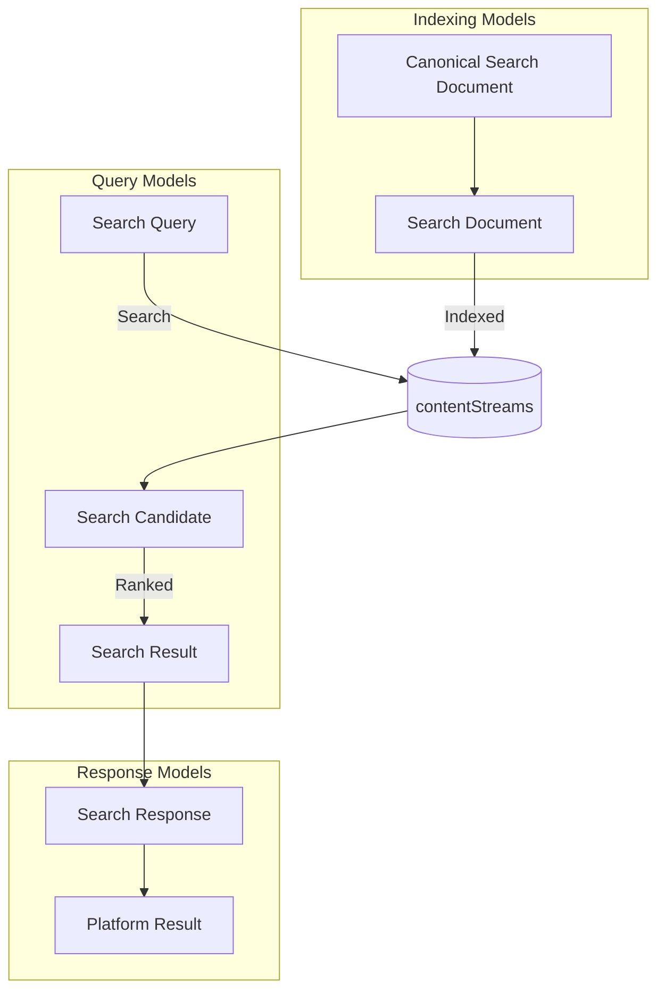

# 03 — Search Domain Model

Status: ✅ Implemented
Phase: Phase 1
Owner: Architect
Last Updated: 2026-07-31
Depends On: [02_Architecture](./02_Architecture.md)
Next Document: [04_Search_Query_Pipeline](./04_Search_Query_Pipeline.md)

---

## 1. Executive Summary

This document defines the core domain models for Gaddr Unified Search. These models establish the shared vocabulary and data contracts between all components in the system: SearchProvider, SearchDocumentBuilder, SearchIndexer, RankingService, and Platform Normalizers.

The models are designed to be platform-independent. No model contains platform-specific fields or logic. Platform-specific data is stored in the `metaData` JSONB column and accessed only by platform-specific code.

---

## 2. Domain Model Overview



---

## 3. Canonical Search Document

The Canonical Search Document is the platform-independent representation of searchable content. It is the output of Platform Normalizers and the input to SearchDocumentBuilder.

### 3.1 Definition

```typescript
interface CanonicalSearchDocument {
  // Identity
  platform: string;              // "youtube", "facebook", "instagram", "pinterest"
  externalId: string;            // Platform-specific ID
  type: StreamEntityType;        // Profile, Content, Community
  subType: string;               // "video", "channel", "post", "page", etc.

  // Content
  title: string;                 // Display title
  description: string;           // Full description text
  tags: string[];                // Platform-specific tags/hashtags

  // Creator
  creatorId: string;             // Platform-specific creator ID
  creatorName: string;           // Creator display name
  creatorAvatar: string;         // Creator avatar URL

  // Media
  thumbnailUrl: string;          // Primary thumbnail URL
  mediaUrl: string;              // Content URL (video, image, link)
  mediaType: string;             // "video", "image", "article", etc.

  // Dates
  publishedAt: Date;             // Content publication date
  importedAt: Date;              // When content was imported

  // Engagement (platform-specific metrics)
  engagement: EngagementMetrics;

  // Platform-specific metadata
  platformMetadata: Record<string, any>;
}

interface EngagementMetrics {
  viewCount?: number;
  likeCount?: number;
  commentCount?: number;
  shareCount?: number;
  subscriberCount?: number;
  followerCount?: number;
}
```

### 3.2 Platform Mapping

| Canonical Field | YouTube | Facebook | Instagram | Pinterest |
|---|---|---|---|---|
| `platform` | `"youtube"` | `"facebook"` | `"instagram"` | `"pinterest"` |
| `externalId` | `videoId` | `post.id` | `media.id` | `pin.id` |
| `type` | `Content` | `Content` | `Content` | `Content` |
| `subType` | `"video"` | `"post"` | `"image"` | `"pin"` |
| `title` | `snippet.title` | `message` | `caption` | `title` |
| `description` | `snippet.description` | `message` | `caption` | `description` |
| `tags` | `snippet.tags` | `[]` | `hashtags` | `[]` |
| `creatorId` | `snippet.channelId` | `from.id` | `user.username` | `board.owner` |
| `creatorName` | `snippet.channelTitle` | `from.name` | `user.name` | `board.name` |
| `thumbnailUrl` | `snippet.thumbnails.default.url` | `picture.url` | `media_url` | `images.orig.url` |
| `publishedAt` | `snippet.publishedAt` | `created_time` | `timestamp` | `created_at` |

---

## 4. Search Document

The Search Document is the indexed representation stored in `contentStreams`. It extends the Canonical Search Document with search-specific fields.

### 4.1 Definition

```typescript
interface SearchDocument {
  // Identity (from CanonicalSearchDocument)
  id: string;                    // UUID (contentStreams.id)
  platform: string;
  externalId: string;
  type: StreamEntityType;
  subType: string;

  // Content
  title: string;
  searchText: string;            // Pre-computed search text
  searchVector: string;          // PostgreSQL tsvector (generated)

  // Ranking signals
  publishedAt: Date;
  engagementScore: number;       // Pre-computed engagement metric
  creatorId: string;

  // Metadata
  metaData: Record<string, any>; // Platform-specific data

  // Timestamps
  lastRefreshed: Date;
  createdOn: Date;
  lastModifiedOn: Date;
}
```

### 4.2 searchText Generation

The `searchText` field is generated by SearchDocumentBuilder:

```
searchText = cleanText(title + " " + description + " " + tags.join(" ") + " " + creatorName)
```

**Cleaning rules:**

1. Convert to lowercase
2. Remove special characters (keep alphanumeric, spaces, hyphens)
3. Normalize whitespace (multiple spaces → single space)
4. Trim leading/trailing whitespace

**Example:**

```typescript
// Input
{
  title: "How to Build a REST API with Node.js",
  description: "In this tutorial, we'll build a REST API using Express.js and TypeScript.",
  tags: ["nodejs", "typescript", "api"],
  creatorName: "Tech Academy"
}

// Output
searchText = "how to build a rest api with node.js in this tutorial we'll build a rest api using express.js and typescript nodejs typescript api tech academy"
```

### 4.3 engagementScore Calculation

The `engagementScore` is a normalized score (0-1) combining platform-specific metrics:

```typescript
function calculateEngagementScore(engagement: EngagementMetrics): number {
  const viewWeight = 0.4;
  const likeWeight = 0.3;
  const commentWeight = 0.2;
  const subscriberWeight = 0.1;

  const viewScore = normalize(engagement.viewCount, MAX_VIEWS);
  const likeScore = normalize(engagement.likeCount, MAX_LIKES);
  const commentScore = normalize(engagement.commentCount, MAX_COMMENTS);
  const subscriberScore = normalize(engagement.subscriberCount, MAX_SUBSCRIBERS);

  return (
    viewScore * viewWeight +
    likeScore * likeWeight +
    commentScore * commentWeight +
    subscriberScore * subscriberWeight
  );
}

function normalize(value: number, max: number): number {
  return Math.min(value / max, 1);
}
```

---

## 5. Search Query

The Search Query represents a user's search request.

### 5.1 Definition

```typescript
interface SearchQuery {
  // Query text
  originalQuery: string;         // Raw user input
  normalizedQuery: string;       // Cleaned, tokenized query

  // Filters
  platforms?: string[];          // Filter by platform(s)
  type?: StreamEntityType;       // Filter by content type
  subType?: string;              // Filter by sub-type
  dateRange?: DateRange;         // Filter by publication date

  // Pagination
  page: number;
  limit: number;

  // Sorting
  sortBy: 'relevance' | 'date' | 'engagement';
  sortOrder: 'asc' | 'desc';

  // Context
  userId?: string;               // Current user ID (for personalization)
}

interface DateRange {
  from?: Date;
  to?: Date;
}
```

### 5.2 Query Normalization

The `normalizedQuery` is generated by `SearchQueryPipeline`:

1. Trim whitespace
2. Convert to lowercase
3. Remove stop words (optional, configurable)
4. Apply fuzzy matching (optional, via `fuseUtil.normalizeSearchTerm`)

---

## 6. Search Candidate

A Search Candidate is a result returned by SearchProvider before ranking. It contains the raw search results with relevance signals.

### 6.1 Definition

```typescript
interface SearchCandidate {
  // Document reference
  document: SearchDocument;

  // Relevance signals from search engine
  textRelevance: number;         // ts_rank score (0-1)
  textSimilarity: number;        // pg_trgm similarity (0-1)
  exactMatch: boolean;           // Title exactly matches query
  phraseRelevance: number;       // Phrase-level relevance
  exactPhrase: boolean;          // Exact phrase match
  interestScore: number;         // Interest-based signal

  // Metadata
  matchedFields: string[];       // Which fields matched the query

  // Identity (populated by CreatorIdentityResolver)
  gaddrIdentity?: ResolvedCreatorIdentity | null;
}
```

The `gaddrIdentity` field is populated during provider search (see `postgresSearchProvider.ts`) via a correlated JSONB subquery that joins `contentStreams → userContents → identity.users → linkedAccounts`, restricted to `profilePrivacy = 'Public'`. See §7.3 for the identity model.

---

## 7. Search Result

A Search Result is a ranked, formatted result ready for the API response.

### 7.1 Definition

```typescript
interface SearchResult {
  // Document reference
  id: string;                    // contentStreams.id
  platform: string;
  externalId: string;
  type: StreamEntityType;
  subType: string;

  // Content
  title: string;
  description: string;
  thumbnailUrl: string;
  mediaUrl: string;

  // Creator (flat fields kept for backward compatibility)
  creatorName: string;
  creatorUsername?: string;
  creatorAvatar: string;

  // Creator (structured identity, preferred by the frontend)
  creator?: ResolvedCreatorIdentity | null;

  // Dates
  publishedAt: Date;

  // Engagement
  engagement: EngagementMetrics;

  // Ranking
  score: number;                 // Final ranking score (0-1)
  rank: number;                  // Position in results (1-based)
  candidateTextRelevance?: number;
  candidatePhraseRelevance?: number;
  candidateInterestScore?: number;
  candidateExactMatch?: boolean;
  candidateExactPhrase?: boolean;

  // Platform-specific data
  platformMetadata: Record<string, any>;
}
```

### 7.2 Creator Identity

`SearchResult.creator` is a `ResolvedCreatorIdentity`. The flat `creatorName` / `creatorUsername` / `creatorAvatar` fields remain for backward compatibility, but every result now carries the structured identity, which includes the Gaddr `userId`, verified flag, handle, and profile URL. The frontend prefers `creator.*` and falls back to the flat fields.

### 7.3 ResolvedCreatorIdentity

```typescript
interface ResolvedCreatorIdentity {
  displayName: string;
  handle: string;
  rawUserName: string | null;
  profileImage: string | null;
  verified: boolean;
  profileUrl: string | null;
  platform: string | null;
  source: CreatorIdentitySource;  // 'linkedAccount' | 'importedMetadata' | 'userProfile' | 'unknown'
  userId?: string | null;          // Gaddr user id when the creator is a linked identity user
}
```

Identity is resolved by `CreatorIdentityResolver` from four tiers, in order:

1. **LINKED_ACCOUNT** — `userContents → linkedAccounts`, matched on `platform` + `externalId` (the user must have `profilePrivacy = 'Public'`).
2. **IMPORTED_METADATA** — creator fields embedded in the imported `metaData` (channel name, handle, avatar, etc.).
3. **USER_PROFILE** — a Gaddr user whose profile matches the imported metadata.
4. **UNKNOWN** — no identity found; `userId` is null and the flat fields may be empty.

The Gaddr `userId` in tier 1/3 enables linking search results to a real Gaddr profile (per-profile pages, follow, etc.).

---

## 8. Search Response

The Search Response is the final API response returned to the frontend.

### 8.1 Definition

```typescript
interface SearchResponse {
  // Query info
  query: string;
  platforms: string[];

  // Results
  results: SearchResult[];
  totalResults: number;

  // Pagination
  page: number;
  limit: number;
  totalPages: number;
  hasNextPage: boolean;
  hasPreviousPage: boolean;

  // Pagination tokens (for platform-specific pagination)
  paginationTokens: Record<string, string | null>;
}
```

### 8.2 Backward Compatibility

The new `SearchResponse` is backward compatible with the existing `GlobalSearchResponseModel`:

| New Field | Existing Field | Mapping |
|---|---|---|
| `results` | `results` | Same structure, platform keys |
| `totalResults` | `totalResults` | Same |
| `page` | `page` | Same |
| `limit` | `limit` | Same |
| `paginationTokens` | `paginationTokens` | Same |

The frontend was updated (2026-07-31) to consume `results` as a flat `SearchResult[]` array with `creator` objects, replacing the per-platform object map.

---

## 9. Domain Events

### 9.1 ContentIndexedEvent

Emitted when a document is indexed into contentStreams.

```typescript
interface ContentIndexedEvent {
  documentId: string;            // contentStreams.id
  platform: string;
  externalId: string;
  type: StreamEntityType;
  action: 'created' | 'updated';
  timestamp: Date;
}
```

### 9.2 ContentEnrichedEvent

Emitted when background enrichment updates a document.

```typescript
interface ContentEnrichedEvent {
  documentId: string;
  platform: string;
  externalId: string;
  enrichedFields: string[];      // Which fields were updated
  timestamp: Date;
}
```

---

## 10. Type Definitions

### 10.1 StreamEntityType

Existing enum, unchanged:

```typescript
enum StreamEntityType {
  Profile = 'Profile',
  Content = 'Content',
  Community = 'Community',
}
```

### 10.2 SearchProviderType

New enum for search engine selection:

```typescript
enum SearchProviderType {
  PostgreSQL = 'postgresql',
  Meilisearch = 'meilisearch',
}
```

### 10.3 SearchSortBy

New enum for sort options:

```typescript
enum SearchSortBy {
  Relevance = 'relevance',
  Date = 'date',
  Engagement = 'engagement',
}
```

---

## 11. Validation Rules

| Field | Rule | Error |
|---|---|---|
| `originalQuery` | Required, 1-200 chars | `QUERY_INVALID` |
| `platforms` | Optional, valid platform names | `PLATFORM_INVALID` |
| `type` | Optional, valid StreamEntityType | `TYPE_INVALID` |
| `page` | Required, >= 1 | `PAGE_INVALID` |
| `limit` | Required, 1-100 | `LIMIT_INVALID` |
| `sortBy` | Required, valid SearchSortBy | `SORT_INVALID` |

---

## 12. Serialization

### 12.1 Database Serialization

| Field | PostgreSQL Type | Notes |
|---|---|---|
| `id` | `uuid` | Primary key |
| `platform` | `varchar` | Indexed |
| `externalId` | `varchar` | Indexed |
| `type` | `enum` | Indexed |
| `subType` | `varchar` | — |
| `title` | `varchar` | — |
| `searchText` | `text` | GIN indexed |
| `searchVector` | `tsvector` | GIN indexed |
| `publishedAt` | `timestamp` | Indexed |
| `engagementScore` | `float` | — |
| `creatorId` | `varchar` | — |
| `metaData` | `jsonb` | GIN indexed |
| `lastRefreshed` | `timestamp` | Indexed |
| `createdOn` | `timestamp` | — |
| `lastModifiedOn` | `timestamp` | — |

> **Identity index (added 2026-07-31):** the identity subquery joins `userContents` on `(platform, externalId)` and `(userId)`. Migration `1785455366000-AddUserContentsPlatformExternalIdIndex` adds the `userContents (platform, externalId)` index so the join stays index-scan even as the table grows. No existing data is modified.

### 12.2 API Serialization

| Field | JSON Type | Example |
|---|---|---|
| `id` | string (UUID) | `"550e8400-e29b-41d4-a716-446655440000"` |
| `platform` | string | `"youtube"` |
| `type` | string | `"Content"` |
| `title` | string | `"How to Build a REST API"` |
| `creator` | object \| null | `{ displayName, handle, verified, userId, ... }` |
| `score` | number | `0.85` |
| `publishedAt` | string (ISO 8601) | `"2026-07-28T12:00:00Z"` |

---

## 13. Related Documents

- [README](./README.md) — Entry point and architecture summary
- [02_Architecture](./02_Architecture.md) — Complete architecture diagrams
- [04_Search_Query_Pipeline](./04_Search_Query_Pipeline.md) — Query lifecycle
- [05_Search_Provider](./05_Search_Provider.md) — SearchProvider interface
- [07_Search_Document_Builder](./07_Search_Document_Builder.md) — searchText generation
- [08_Ranking_Engine](./08_Ranking_Engine.md) — Ranking formulas
