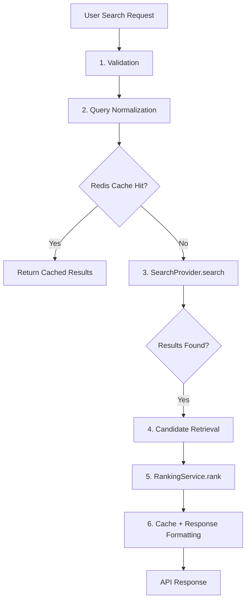
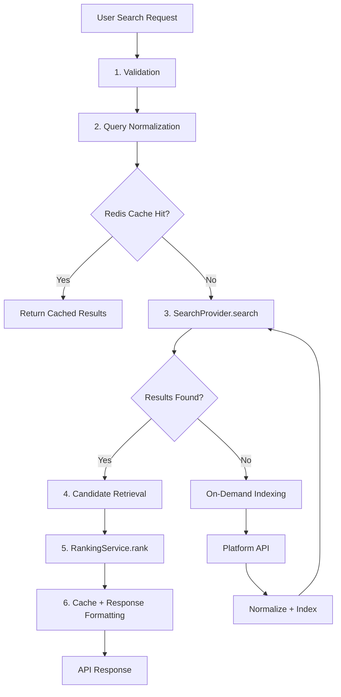
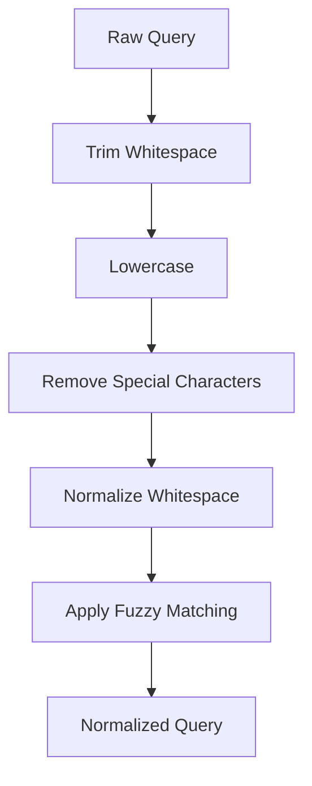

# 04 — Search Query Pipeline

Status: ✅ Implemented
Phase: Phase 1
Owner: Backend
Last Updated: 2026-07-31
Depends On: [03_Search_Domain_Model](./03_Search_Domain_Model.md)
Next Document: [05_Search_Provider](./05_Search_Provider.md)

---

## 1. Executive Summary

This document defines the complete lifecycle of a search query in Gaddr Unified Search, from user input to API response. The pipeline transforms a raw search request into ranked results through six stages: validation, normalization, provider search, candidate retrieval, ranking, and response formatting.

The pipeline is designed for sub-100ms total latency. Query normalization (< 5ms), Redis cache check (< 1ms), provider search (< 50ms), and ranking (< 10ms) are the primary components. When no matching content exists in Redis or PostgreSQL (cache miss), the pipeline triggers on-demand indexing via platform API call.

---

## 2. Pipeline Overview

### 2.1 Redis Cache Hit Pipeline



### 2.2 PostgreSQL Hit Pipeline



> **Important**
>
> Cache miss API calls must be non-blocking. If the platform API is slow or unavailable, return partial results or an empty result set. Never block the entire search pipeline waiting for a single platform.

---

## 3. Stage 1: Validation

**Input:** Raw user request
**Output:** Validated `SearchQuery` object
**Latency:** < 1ms

### 3.1 Validation Rules

| Field | Rule | Error |
|---|---|---|
| `searchTerm` | Required, 1-200 chars | `SEARCH_TERM_INVALID` |
| `platforms` | Optional, valid platform names | `PLATFORM_INVALID` |
| `type` | Optional, valid StreamEntityType | `TYPE_INVALID` |
| `page` | Optional, >= 1, default 1 | `PAGE_INVALID` |
| `limit` | Optional, 1-100, default 25 | `LIMIT_INVALID` |
| `sortBy` | Optional, valid SearchSortBy, default "relevance" | `SORT_INVALID` |

### 3.2 Platform Validation

```typescript
function validatePlatforms(platforms: string[]): string[] {
  const validPlatforms = Object.values(_const.PLATFORMS);
  return platforms.filter(p => validPlatforms.includes(p.toLowerCase()));
}
```

### 3.3 Output

```typescript
{
  originalQuery: "how to build a rest api",
  normalizedQuery: "",           // Set in Stage 2
  platforms: ["youtube"],
  type: undefined,
  page: 1,
  limit: 25,
  sortBy: "relevance",
  sortOrder: "desc"
}
```

---

## 4. Stage 2: Query Normalization

**Input:** Validated `SearchQuery`
**Output:** `SearchQuery` with `normalizedQuery` populated
**Latency:** < 5ms

### 4.1 Normalization Steps



### 4.2 Implementation

```typescript
function normalizeQuery(query: string): string {
  // 1. Trim
  let normalized = query.trim();

  // 2. Lowercase
  normalized = normalized.toLowerCase();

  // 3. Remove special characters (keep alphanumeric, spaces, hyphens)
  normalized = normalized.replace(/[^a-z0-9\s-]/g, '');

  // 4. Normalize whitespace
  normalized = normalized.replace(/\s+/g, ' ').trim();

  return normalized;
}
```

### 4.3 Fuzzy Matching

The pipeline uses `fuseUtil.normalizeSearchTerm` for fuzzy matching:

```typescript
const normalizedQuery = fuseUtil.normalizeSearchTerm(
  trimmedQuery,
  candidateValues  // From search history
);
```

This provides:

- Typo tolerance ("rest api" → "rest api")
- Synonym matching ("javascript" → "js")
- Abbreviation expansion ("js" → "javascript")

### 4.4 Search History Integration

The pipeline integrates with search history for query normalization:

```typescript
const similarQueries = await searchHistoryRepository.findSimilarQueriesAsync(trimmedQuery);
const candidateValues = similarQueries.map(item => item.normalizedQuery).slice(0, 50);
```

---

## 5. Stage 3: SearchProvider.search

**Input:** Normalized `SearchQuery`
**Output:** `SearchCandidate[]`
**Latency:** < 1ms (Redis cache hit), < 50ms (PostgreSQL), 200-2000ms (cache miss)

### 5.1 Provider Selection

The feature flag routing was removed (2026-07-31). `POST /search` now always runs the consolidated pipeline: `SearchOrchestratorService` executes the registered providers concurrently (`unified`, `legacy`, `project`, each with a per-provider timeout), appends the direct `userContents` search results, re-runs the unified provider when the legacy provider persisted new external content, then passes everything through `MergePipeline` for deduplication, ranking and pagination.

```typescript
const providerResults = await this.executeProviders(model); // unified + legacy + project, raced with timeouts
const userContentResults = await this.searchUserContents(model); // direct userContents search
providerResults.push(userContentResults); // when non-empty

// If legacy persisted external content that unified has not indexed yet, re-run unified once
if (legacyContentResults > 0 && unifiedContentResults < legacyContentResults) {
  const refreshedUnified = await this.executeSingleProvider('unified', model);
  providerResults[unifiedIdx] = refreshedUnified;
}

const merged = this.mergePipeline.execute(providerResults);
```

### 5.1.1 Creator Identity Resolution

Every result now carries structured creator identity. Identity is resolved in two places:

- **PostgreSQL provider (`unified`)** — a correlated JSONB subquery (`gaddrIdentitySelect`) resolves the identity in the same SQL statement, joined as `contentStreams → userContents → identity.users → linkedAccounts`, restricted to `profilePrivacy = 'Public'`. No additional queries, no N+1. See §5.4.
- **Direct userContents search** — `SearchOrchestratorService.searchUserContents` builds the identity from `uc.user` + `uc.linkedAccount` + `uc.metaData` (the repository now `leftJoinAndSelect`'s both relations) and passes it to `contentStreamToSearchResult`.
- **Legacy provider** — routes its inline creator extraction through `resolveItemIdentity` (the same `ImportedMetadata` tier).

All three funnel into `CreatorIdentityResolver.resolve`, which returns a `ResolvedCreatorIdentity` (with `userId` when the creator is a Gaddr user). The adapters apply it as the `creator` object and prefer its values for the flat `creatorName`/`creatorUsername`/`creatorAvatar` fields.

### 5.2 Search Execution with Three-Tier Retrieval

```typescript
async searchWithThreeTierRetrieval(query: SearchQuery): Promise<SearchCandidate[]> {
  // 1. Check Redis cache first (fastest)
  const cacheKey = this.buildCacheKey(query);
  const cached = await this.redis.getFromRedisAsync(cacheKey);
  if (cached) {
    return cached; // Redis cache hit (< 1ms)
  }

  // 2. Search PostgreSQL contentStreams
  const candidates = await this.searchProvider.search(query);

  // 3. If results found, cache and return (PostgreSQL hit)
  if (candidates.length > 0) {
    await this.redis.storeInRedisAsync(cacheKey, candidates, SEARCH_CACHE.QUERY_CACHE_TTL_SEC);
    return candidates;
  }

  // 4. If no results found (cache miss), trigger on-demand indexing
  return this.onDemandIndex(query);
}
```

### 5.3 On-Demand Indexing (Cache Miss)

```typescript
private async onDemandIndex(query: SearchQuery): Promise<SearchCandidate[]> {
  const platform = query.platforms?.[0] || 'youtube';

  try {
    // 1. Call platform API
    const response = await this.platformApiService.search(platform, query.originalQuery);

    // 2. Normalize response
    const canonicalDocs = this.platformNormalizer.normalizeBatch(response.items);

    // 3. Build search documents
    const searchDocs = canonicalDocs.map(doc => this.searchDocumentBuilder.build(doc));

    // 4. Index into contentStreams
    await this.searchIndexer.indexBatch(searchDocs);

    // 5. Search again (content is now indexed)
    const candidates = await this.searchProvider.search(query);

    // 6. Cache results in Redis
    if (candidates.length > 0) {
      const cacheKey = this.buildCacheKey(query);
      await this.redis.storeInRedisAsync(cacheKey, candidates, SEARCH_CACHE.QUERY_CACHE_TTL_SEC);
    }

    return candidates;
  } catch (error) {
    // 7. On API failure, return empty results (never block search)
    logger.warn(`On-demand indexing failed for ${platform}`, error);
    return [];
  }
}
```

### 5.4 PostgreSQL Search Query

The `PostgresSearchProvider` runs a single SQL statement: the content match against `contentStreams` plus a correlated identity subquery. A raw `LATERAL` join is intentionally avoided because TypeORM mangles `LATERAL (...)` string joins; the correlated scalar `jsonb` subquery produces the same result (one index-scan per row, bounded by `LIMIT`).

```sql
SELECT cs.*,
       ts_rank_cd(cs."searchVector", websearch_to_tsquery('english', :webQuery)) AS "textRelevance",
       similarity(cs."searchText", :similarityQuery) AS "textSimilarity",
       CASE WHEN cs.title ILIKE :exactQuery THEN 1 ELSE 0 END AS "exactMatch",
       -- Correlated identity subquery (creator resolution, same statement)
       (
         SELECT to_jsonb(idn) FROM (
           SELECT u."id" AS "userId",
                  u."firstName", u."lastName", u."userName",
                  la."userName" AS "linkedAccountUserName",
                  la."profileImage" AS "linkedAccountProfileImage",
                  la."verified" AS "linkedAccountVerified",
                  la."externalUrl" AS "linkedAccountExternalUrl",
                  la."metaData" AS "linkedAccountMetaData",
                  la."platform" AS "linkedAccountPlatform"
           FROM "userContents" uc
           INNER JOIN "identity"."users" u ON u."id" = uc."userId"
           LEFT JOIN "linkedAccounts" la ON la."id" = uc."linkedAccountId"
           WHERE uc."platform" = cs."platform"
             AND uc."externalId" = cs."externalId"
             AND u."profilePrivacy" = 'Public'
           LIMIT 1
         ) idn
       ) AS "gaddrIdentity"
FROM contentStreams cs
WHERE (
  cs."searchVector" @@ websearch_to_tsquery('english', :webQuery)
  OR cs."searchVector" @@ phraseto_tsquery('english', :phraseQuery)
  OR cs."searchText" % :similarityQuery
  OR cs."title" ILIKE :exactQuery
)
AND (:platform IS NULL OR cs.platform = :platform)
AND (:type IS NULL OR cs.type = :type)
ORDER BY
  CASE WHEN :sortBy = 'relevance' THEN
    COALESCE(ts_rank_cd(cs."searchVector", websearch_to_tsquery('english', :webQuery)), 0)
  WHEN :sortBy = 'date' THEN
    EXTRACT(EPOCH FROM cs."publishedAt")
  WHEN :sortBy = 'engagement' THEN
    cs."engagementScore"
  END DESC
LIMIT :limit OFFSET :offset
```

The identity subquery is backed by the `userContents (platform, externalId)` index added in migration `1785455366000-AddUserContentsPlatformExternalIdIndex`. Rows with no public Gaddr user match return `null` for `gaddrIdentity`, and the provider then resolves identity from the imported `metaData` via `CreatorIdentityResolver`.

---

## 6. Stage 4: Candidate Retrieval

**Input:** `SearchCandidate[]` from provider
**Output:** Enriched `SearchCandidate[]`
**Latency:** < 5ms

### 6.1 Enrichment

The pipeline enriches candidates with additional data:

```typescript
const enrichedCandidates = await Promise.all(
  candidates.map(async (candidate) => ({
    ...candidate,
    // Add engagement metrics
    engagement: await getEngagementMetrics(candidate.document.id),
  }))
);
```

Creator identity is **not** resolved with a per-candidate await. It is attached to the candidate during provider search:

- The PostgreSQL provider resolves it inside the SQL statement (correlated subquery) and via `CreatorIdentityResolver`.
- The direct `userContents` path builds it from the joined `user` + `linkedAccount` relations.

This keeps identity resolution out of the hot path (no N+1) while guaranteeing every `SearchCandidate` carries `gaddrIdentity` before ranking.

### 6.2 Deduplication

The pipeline deduplicates results by `platform` + `externalId`:

```typescript
const uniqueCandidates = deduplicateByPlatformAndExternalId(enrichedCandidates);
```

---

## 7. Stage 5: RankingService.rank

**Input:** Enriched `SearchCandidate[]`
**Output:** Ranked `SearchResult[]`
**Latency:** < 10ms

### 7.1 Ranking Formula

```typescript
function rankCandidate(candidate: SearchCandidate): number {
  const textScore = candidate.textRelevance * 0.4;
  const engagementScore = candidate.engagementScore * 0.25;
  const freshnessScore = calculateFreshness(candidate.document.publishedAt) * 0.2;
  const authorityScore = calculateAuthority(candidate.document.creatorId) * 0.1;
  const platformScore = calculatePlatformWeight(candidate.document.platform) * 0.05;

  return textScore + engagementScore + freshnessScore + authorityScore + platformScore;
}
```

### 7.2 Freshness Calculation

```typescript
function calculateFreshness(publishedAt: Date): number {
  const now = new Date();
  const ageInDays = (now.getTime() - publishedAt.getTime()) / (1000 * 60 * 60 * 24);

  // Exponential decay: score = e^(-ageInDays / 30)
  return Math.exp(-ageInDays / 30);
}
```

### 7.3 Authority Calculation

```typescript
function calculateAuthority(creatorId: string): number {
  const creator = getCreator(creatorId);
  const subscriberCount = creator.subscriberCount || 0;

  // Logarithmic scale: score = log(1 + subscriberCount) / log(1 + MAX_SUBSCRIBERS)
  return Math.log(1 + subscriberCount) / Math.log(1 + 10000000);
}
```

### 7.4 Platform Weight

```typescript
function calculatePlatformWeight(platform: string): number {
  const weights: Record<string, number> = {
    youtube: 1.0,
    facebook: 0.9,
    instagram: 0.9,
    pinterest: 0.8,
    reddit: 0.8,
    spotify: 0.7,
    twitter: 0.9,
    linkedin: 0.7,
    tiktok: 0.9,
    snapchat: 0.6,
    threads: 0.7,
    behance: 0.6,
  };

  return weights[platform] || 0.5;
}
```

---

## 8. Stage 6: Response Formatting

**Input:** Ranked `SearchResult[]`
**Output:** `SearchResponse`
**Latency:** < 5ms

### 8.1 Pagination

```typescript
function formatResponse(
  results: SearchResult[],
  totalResults: number,
  page: number,
  limit: number
): SearchResponse {
  return {
    query: originalQuery,
    platforms: platforms,
    results: results,
    totalResults: totalResults,
    page: page,
    limit: limit,
    totalPages: Math.ceil(totalResults / limit),
    hasNextPage: page * limit < totalResults,
    hasPreviousPage: page > 1,
    paginationTokens: {}  // Empty for unified search
  };
}
```

### 8.2 Backward Compatibility

The response format matches the existing `GlobalSearchResponseModel`:

```typescript
// Existing format
{
  query: string,
  platforms: string[],
  results: { [platform: string]: any },
  paginationTokens: { [platform: string]: string | null },
  totalResults: number,
  page: number,
  limit: number
}

// New format (backward compatible)
{
  query: string,
  platforms: string[],
  results: SearchResult[],  // Array instead of object
  paginationTokens: {},
  totalResults: number,
  page: number,
  limit: number
}
```

> **Important**
>
> The new format is backward compatible. The frontend consumes the flat `SearchResult[]` (grouped by platform in the response envelope) and was updated to prefer the `creator` object. The feature flag that controlled the format during rollout was removed (2026-07-31).

---

## 9. Error Handling

### 9.1 Provider Errors

Providers run concurrently under per-provider timeouts. A single provider failure or timeout degrades gracefully — the others still contribute and the request never blocks:

```typescript
try {
  const result = await provider.search(model);
  results.push(result);
} catch (error) {
  logger.warn(`[Orchestrator] Provider rejected: ${error.reason}`);
  // Continue with the remaining providers' results
}
```

### 9.2 Ranking Errors

```typescript
try {
  const ranked = rankingService.rank(candidates);
} catch (error) {
  // Return unranked results if ranking fails
  logger.warn('Ranking failed, returning unranked results', error);
  return candidates.map((c, i) => ({
    ...c.document,
    score: c.textRelevance,
    rank: i + 1
  }));
}
```

---

## 10. Performance Optimization

### 10.1 Three-Tier Retrieval

The pipeline implements a three-tier retrieval strategy for optimal performance:

| Tier | Latency | Description |
|---|---|---|
| Redis Cache | < 1ms | Cached search responses |
| PostgreSQL | < 50ms | Full-text search with GIN indexes |
| Platform API | 200-2000ms | On-demand indexing (cache miss only) |

### 10.2 Cache Key Strategy

```typescript
function buildCacheKey(query: SearchQuery): string {
  // Normalize query for consistent cache keys
  const normalized = normalizeQuery(query.originalQuery);
  const platforms = query.platforms?.sort().join(',') || 'all';
  const type = query.type || 'all';
  const page = query.page || 1;
  const limit = query.limit || 25;

  return `search:${normalized}:${platforms}:${type}:${page}:${limit}`;
}
```

### 10.3 Cache Expiration

| Query Type | TTL | Rationale |
|---|---|---|
| Popular searches | 15-30 minutes | High traffic, moderate freshness |
| Normal searches | 1-6 hours | Balanced freshness and performance |
| Rare searches | 24 hours | Low traffic, cache longer |
| Negative cache | 5-10 minutes | Prevent repeated API calls for non-existent content |

### 10.4 Connection Pooling

The pipeline reuses the existing PostgreSQL and Redis connection pools. No new connections are created.

---

## 11. Monitoring

### 11.1 Metrics

| Metric | Description | Target |
|---|---|---|
| `search.query.duration` | Total pipeline duration | < 100ms |
| `search.query.validation` | Validation stage duration | < 1ms |
| `search.query.normalization` | Normalization stage duration | < 5ms |
| `search.query.provider` | Provider search duration | < 50ms |
| `search.query.ranking` | Ranking stage duration | < 10ms |
| `search.query.results` | Number of results returned | 0-100 |
| `search.query.cache_hit` | Cache hit rate | > 80% |

### 11.2 Logging

```typescript
logger.info('Search query executed', {
  query: originalQuery,
  normalizedQuery: normalizedQuery,
  platforms: platforms,
  results: results.length,
  duration: totalDuration,
  cacheHit: cacheHit
});
```

---

## 12. Testing Strategy

### 12.1 Unit Tests

- Validation logic
- Query normalization
- Ranking formula
- Freshness calculation
- Authority calculation

### 12.2 Integration Tests

- SearchProvider.search with PostgreSQL
- Full pipeline end-to-end
- Cache hit/miss scenarios

### 12.3 Load Tests

- 100 concurrent search requests
- Latency under load
- Memory usage under load

---

## 13. Related Documents

- [README](./README.md) — Entry point and architecture summary
- [03_Search_Domain_Model](./03_Search_Domain_Model.md) — Domain model definitions
- [05_Search_Provider](./05_Search_Provider.md) — SearchProvider interface
- [08_Ranking_Engine](./08_Ranking_Engine.md) — Ranking formulas
- [17_Testing_Strategy](./17_Testing_Strategy.md) — Testing approach
