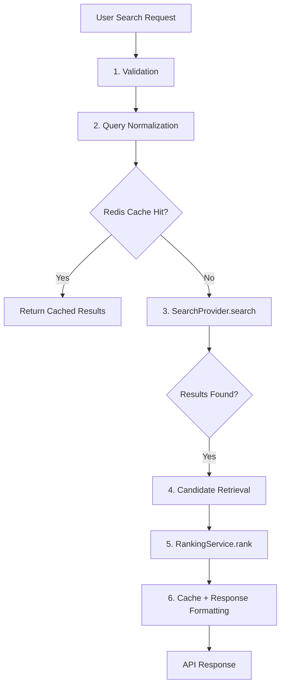
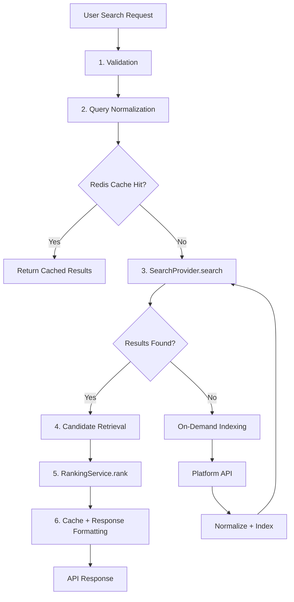
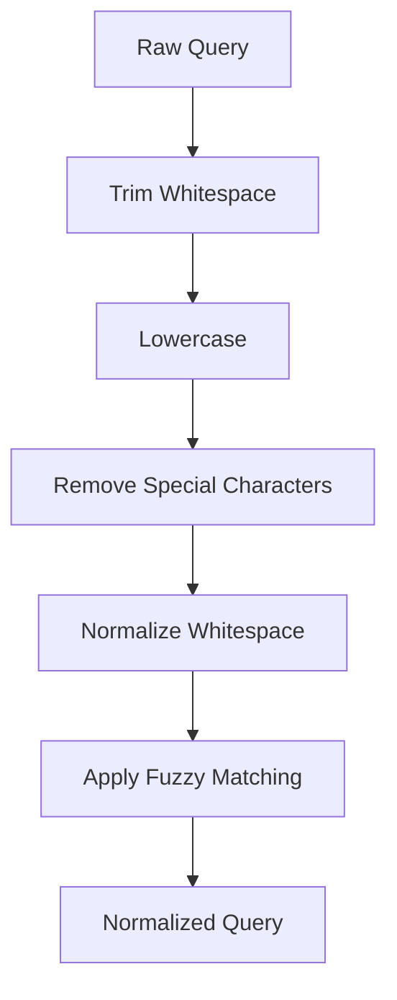
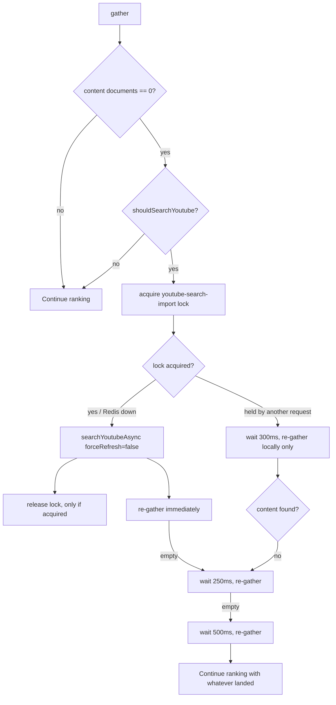

# 04 — Search Query Pipeline

Status: ✅ Implemented
Phase: Phase 1
Owner: Backend
Last Updated: 2026-08-01
Depends On: [03_Search_Domain_Model](./03_Search_Domain_Model.md)
Next Document: [05_Search_Provider](./05_Search_Provider.md)

---

## 1. Executive Summary

This document defines the complete lifecycle of a search query in Gaddr Unified Search, from user input to API response. The pipeline transforms a raw search request into ranked results through six stages: validation, normalization, provider search, candidate retrieval, ranking, and response formatting.

The pipeline is designed for sub-100ms total latency. Query normalization (< 5ms), Redis cache check (< 1ms), provider search (< 50ms), and ranking (< 10ms) are the primary components. When no matching content exists in Redis or PostgreSQL (cache miss), the pipeline triggers on-demand indexing via platform API call.

---

## 2. Pipeline Overview

### 2.1 Redis Cache Hit Pipeline



### 2.2 PostgreSQL Hit Pipeline



> **Important**
>
> Cache miss API calls must be non-blocking. If the platform API is slow or unavailable, return partial results or an empty result set. Never block the entire search pipeline waiting for a single platform.

---

## 3. Stage 1: Validation

**Input:** Raw user request
**Output:** Validated `SearchQuery` object
**Latency:** < 1ms

### 3.1 Validation Rules

| Field | Rule | Error |
|---|---|---|
| `searchTerm` | Required, 1-200 chars | `SEARCH_TERM_INVALID` |
| `platforms` | Optional, valid platform names | `PLATFORM_INVALID` |
| `type` | Optional, valid StreamEntityType | `TYPE_INVALID` |
| `page` | Optional, >= 1, default 1 | `PAGE_INVALID` |
| `limit` | Optional, 1-100, default 25 | `LIMIT_INVALID` |
| `sortBy` | Optional, valid SearchSortBy, default "relevance" | `SORT_INVALID` |

### 3.2 Platform Validation

```typescript
function validatePlatforms(platforms: string[]): string[] {
  const validPlatforms = Object.values(_const.PLATFORMS);
  return platforms.filter(p => validPlatforms.includes(p.toLowerCase()));
}
```

### 3.3 Output

```typescript
{
  originalQuery: "how to build a rest api",
  normalizedQuery: "",           // Set in Stage 2
  platforms: ["youtube"],
  type: undefined,
  page: 1,
  limit: 25,
  sortBy: "relevance",
  sortOrder: "desc"
}
```

---

## 4. Stage 2: Query Normalization

**Input:** Validated `SearchQuery`
**Output:** `SearchQuery` with `normalizedQuery` populated
**Latency:** < 5ms

### 4.1 Normalization Steps



### 4.2 Implementation

```typescript
function normalizeQuery(query: string): string {
  // 1. Trim
  let normalized = query.trim();

  // 2. Lowercase
  normalized = normalized.toLowerCase();

  // 3. Remove special characters (keep alphanumeric, spaces, hyphens)
  normalized = normalized.replace(/[^a-z0-9\s-]/g, '');

  // 4. Normalize whitespace
  normalized = normalized.replace(/\s+/g, ' ').trim();

  return normalized;
}
```

### 4.3 Fuzzy Matching

The pipeline uses `fuseUtil.normalizeSearchTerm` for fuzzy matching:

```typescript
const normalizedQuery = fuseUtil.normalizeSearchTerm(
  trimmedQuery,
  candidateValues  // From search history
);
```

This provides:

- Typo tolerance ("rest api" → "rest api")
- Synonym matching ("javascript" → "js")
- Abbreviation expansion ("js" → "javascript")

### 4.4 Search History Integration

The pipeline integrates with search history for query normalization:

```typescript
const similarQueries = await searchHistoryRepository.findSimilarQueriesAsync(trimmedQuery);
const candidateValues = similarQueries.map(item => item.normalizedQuery).slice(0, 50);
```

---

## 5. Stage 3: Repository Search (SearchOrchestratorService)

**Input:** Normalized `SearchRepositoryQuery`
**Output:** `IndexDocument[]` merged across repositories
**Latency:** ~1ms (Redis cache hit), < 50ms (PostgreSQL), up to a few seconds when the YouTube fallback imports (content-index miss only)

### 5.1 Flat Pipeline

The consolidated pipeline is a flat `SearchOrchestratorService`. The `SearchProvider`, `SearchDocumentBuilder`, `SearchIndexer`, `MergePipeline`, `platformApiService` and `platformNormalizer` components named in earlier design docs do not exist in the codebase; the orchestrator reads repositories, then ranks and shapes the response itself.

```mermaid
graph TD
    A[POST /v1/search] --> B[GlobalSearchQueryHandler]
    B --> C[SearchOrchestratorService.execute]
    C --> D{Unified Redis cache?}
    D --> |Yes| E[Return cached SearchResponse]
    D --> |No| F[gather: ISearchRepository[] concurrently]
    F --> G[CandidateFactory.build]
    G --> H[RankingEngine.rank via RankingStrategyRegistry]
    H --> I[SearchIdentityResolver.resolve]
    I --> J[ResponseAdapter -> flat SearchResponse]
    J --> K[Store unified cache + return]
    F --> |content portion empty| L[YouTube Search Fallback]
    L --> F
```

- `POST /v1/search` (`search.endpoint.ts`) → `GlobalSearchQueryHandler` → `SearchOrchestratorService.execute`.
- The unified cache (`SearchCacheService`) keys on `(normalizedQuery, platforms, type, page, limit)` with popularity-based TTLs. `forceRefresh` bypasses it.
- `gather()` runs every registered `ISearchRepository` concurrently — `contentStream`, `profile`, `project`, `job`. Each repository only retrieves and projects ranking primitives; it never ranks, resolves identity or builds wire DTOs. A single repository failure degrades to zero rows from that repository; the others still contribute.
- The `contentStream` repository maps **every** contentStream row — videos and imported channels alike — to `SearchEntityType.CONTENT`, and intentionally returns `[]` when `entityType` is anything other than `CONTENT` (`content-stream.search.repository.ts`). The `profile` repository reads only `identity.users`, so imported YouTube rows never appear as PROFILE results.
- Ranking happens once over the merged documents; pagination is applied to the final ranked list, not per source.

### 5.2 Creator Identity Resolution

Identity is attached to candidates after ranking (never N+1, never per-provider): for every candidate of type `PROFILE` or carrying a `creatorId`, `SearchIdentityResolver.resolve` is invoked and applied by the adapters as the `creator` object (preferred for the flat `creatorName` / `creatorUsername` / `creatorAvatar` fields). The `contentStream` repository already projects the creator join (`identity.users` on `creatorId`, privacy + active enforced) and follower/verified primitives, so the resolver only fills gaps.

### 5.3 YouTube Search Fallback (Content-Index Miss)

When the **content** portion of a search returns nothing locally, the orchestrator enriches the canonical index once through the existing platform search, then re-reads locally. The ranking and response pipeline is untouched — there is no separate "YouTube search mode".



**Trigger** — fires only when the fallback can actually be read back:

```typescript
const contentCount = documents.filter(
  (d) => d.type === SearchEntityType.CONTENT,
).length;

if (contentCount === 0 && shouldSearchYoutube(model)) {
  await this.maybeRunYouTubeFallback(model, query, documents);
}
```

`shouldSearchYoutube` requires: a non-empty search term, `entityType` is `undefined` or `CONTENT` (profile, project and job searches are excluded — their repositories filter content out, so an import could never surface), and `platforms` is empty or includes `youtube`.

**Unified cache interaction** — a cached `SearchResponse` is normally returned as-is, but a cached response whose **content portion is empty** (`facets.content === 0`) for a fallback-eligible query is *not* returned early: the pipeline re-runs so the enrichment is evaluated. This is quota-safe (`searchYoutubeAsync` still honours its own platform cache and import lock, so the API is called at most once per query per window) and lets a stale empty cache self-heal once new entries exist.

| Search | Local Profiles | Local Content | Fallback |
|---|---|---|---|
| All | 15 | 0 | ✅ |
| All | 0 | 0 | ✅ |
| All | 5 | 8 | ❌ |
| Content | — | 0 | ✅ |
| Content | — | 12 | ❌ |
| Profile | 0 | 0 | ❌ |
| Project / Job | — | — | ❌ |
| Platform = Twitter | 0 | 0 | ❌ |
| Platform = YouTube | 0 | 0 | ✅ |

**Import** — `ISearchService.searchYoutubeAsync({ page: 1, limit, originalQuery, normalizedQuery, filters: {}, forceRefresh: false })`. `forceRefresh=false` reuses the platform's own cache, staleness check, DB-first read and internal lock, so at most one YouTube `search.list` call happens per query per cache window. Imported rows land in `contentStreams` via `ContentStreamIndexService.indexBatch` (upsert on `(platform, externalId)`); `userContents` is **not** touched — it is written only by the separate import pipeline.

**Lock** — a Redis lock (`youtube-search-import:{normalizedQuery}`, TTL 180s, `SEARCH_CACHE.YOUTUBE_IMPORT_LOCK_TTL_SEC`) is an **optimization, not a dependency**:

- Acquired → import; released in `finally` only when this request acquired it.
- Redis error → warn and import **without** the lock (a cache miss must not be an outage).
- Held by another request → wait 300ms, then re-read locally only. Never a second YouTube call.

**Retries** — deterministic local-only re-reads with backoff: immediate, then 250ms, then 500ms. Max two additional local reads; never another platform call. If a successful import still yields nothing, the reason is `no_new_results`.

**Failure handling** — the fallback never throws to the handler. On import failure it logs, re-reads locally, and returns a valid (possibly empty) `SearchResponse` with `reason: 'api_error'`.

### 5.4 Response Metadata

`SearchResponse` gains an **optional** `fallback` field (additive; older clients are unaffected):

```typescript
fallback?: {
  attempted: boolean;                  // a fallback was evaluated/run
  succeeded: boolean;                  // content documents were returned
  source?: 'youtube_import' | 'local'; // this request imported vs. a concurrent import landed
  importedCount?: number;              // items the platform search found for the query
  reason?: 'api_error' | 'no_new_results';
}
```

Frontend contract: treat `fallback` as optional telemetry only. `succeeded === true` means the response contains enriched content; ranking semantics are unchanged.

### 5.5 PostgreSQL Content Query

The `contentStream` repository runs a single SQL statement against `contentStreams` with a direct join to `identity.users` on `creatorId` (privacy + active enforced) and projects the ranking primitives: `ts_rank_cd` (web/phrase), `pg_trgm` similarity, exact title match, engagement, and a logarithmic creator-authority score. No `userContents` correlation is used; legacy non-uuid `creatorId` values simply do not match and the privacy rule drops the row.

---

## 6. Stage 4: Candidate Retrieval

**Input:** `SearchCandidate[]` from provider
**Output:** Enriched `SearchCandidate[]`
**Latency:** < 5ms

### 6.1 Enrichment

The pipeline enriches candidates with additional data:

```typescript
const enrichedCandidates = await Promise.all(
  candidates.map(async (candidate) => ({
    ...candidate,
    // Add engagement metrics
    engagement: await getEngagementMetrics(candidate.document.id),
  }))
);
```

Creator identity is **not** resolved with a per-candidate await. It is attached to the candidate during provider search:

- The PostgreSQL provider resolves it inside the SQL statement (correlated subquery) and via `CreatorIdentityResolver`.
- The direct `userContents` path builds it from the joined `user` + `linkedAccount` relations.

This keeps identity resolution out of the hot path (no N+1) while guaranteeing every `SearchCandidate` carries `gaddrIdentity` before ranking.

### 6.2 Deduplication

The pipeline deduplicates results by `platform` + `externalId`:

```typescript
const uniqueCandidates = deduplicateByPlatformAndExternalId(enrichedCandidates);
```

---

## 7. Stage 5: RankingService.rank

**Input:** Enriched `SearchCandidate[]`
**Output:** Ranked `SearchResult[]`
**Latency:** < 10ms

### 7.1 Ranking Formula

```typescript
function rankCandidate(candidate: SearchCandidate): number {
  const textScore = candidate.textRelevance * 0.4;
  const engagementScore = candidate.engagementScore * 0.25;
  const freshnessScore = calculateFreshness(candidate.document.publishedAt) * 0.2;
  const authorityScore = calculateAuthority(candidate.document.creatorId) * 0.1;
  const platformScore = calculatePlatformWeight(candidate.document.platform) * 0.05;

  return textScore + engagementScore + freshnessScore + authorityScore + platformScore;
}
```

### 7.2 Freshness Calculation

```typescript
function calculateFreshness(publishedAt: Date): number {
  const now = new Date();
  const ageInDays = (now.getTime() - publishedAt.getTime()) / (1000 * 60 * 60 * 24);

  // Exponential decay: score = e^(-ageInDays / 30)
  return Math.exp(-ageInDays / 30);
}
```

### 7.3 Authority Calculation

```typescript
function calculateAuthority(creatorId: string): number {
  const creator = getCreator(creatorId);
  const subscriberCount = creator.subscriberCount || 0;

  // Logarithmic scale: score = log(1 + subscriberCount) / log(1 + MAX_SUBSCRIBERS)
  return Math.log(1 + subscriberCount) / Math.log(1 + 10000000);
}
```

### 7.4 Platform Weight

```typescript
function calculatePlatformWeight(platform: string): number {
  const weights: Record<string, number> = {
    youtube: 1.0,
    facebook: 0.9,
    instagram: 0.9,
    pinterest: 0.8,
    reddit: 0.8,
    spotify: 0.7,
    twitter: 0.9,
    linkedin: 0.7,
    tiktok: 0.9,
    snapchat: 0.6,
    threads: 0.7,
    behance: 0.6,
  };

  return weights[platform] || 0.5;
}
```

---

## 8. Stage 6: Response Formatting

**Input:** Ranked `SearchResult[]`
**Output:** `SearchResponse`
**Latency:** < 5ms

### 8.1 Pagination

```typescript
function formatResponse(
  results: SearchResult[],
  totalResults: number,
  page: number,
  limit: number
): SearchResponse {
  return {
    query: originalQuery,
    platforms: platforms,
    results: results,
    totalResults: totalResults,
    page: page,
    limit: limit,
    totalPages: Math.ceil(totalResults / limit),
    hasNextPage: page * limit < totalResults,
    hasPreviousPage: page > 1,
    paginationTokens: {}  // Empty for unified search
  };
}
```

### 8.2 Backward Compatibility

The response format matches the existing `GlobalSearchResponseModel`:

```typescript
// Existing format
{
  query: string,
  platforms: string[],
  results: { [platform: string]: any },
  paginationTokens: { [platform: string]: string | null },
  totalResults: number,
  page: number,
  limit: number
}

// New format (backward compatible)
{
  query: string,
  platforms: string[],
  results: SearchResult[],  // Array instead of object
  paginationTokens: {},
  totalResults: number,
  page: number,
  limit: number
}
```

> **Important**
>
> The new format is backward compatible. The frontend consumes the flat `SearchResult[]` (grouped by platform in the response envelope) and was updated to prefer the `creator` object. The feature flag that controlled the format during rollout was removed (2026-07-31).

---

## 9. Error Handling

### 9.1 Provider Errors

Providers run concurrently under per-provider timeouts. A single provider failure or timeout degrades gracefully — the others still contribute and the request never blocks:

```typescript
try {
  const result = await provider.search(model);
  results.push(result);
} catch (error) {
  logger.warn(`[Orchestrator] Provider rejected: ${error.reason}`);
  // Continue with the remaining providers' results
}
```

### 9.2 Ranking Errors

```typescript
try {
  const ranked = rankingService.rank(candidates);
} catch (error) {
  // Return unranked results if ranking fails
  logger.warn('Ranking failed, returning unranked results', error);
  return candidates.map((c, i) => ({
    ...c.document,
    score: c.textRelevance,
    rank: i + 1
  }));
}
```

---

## 10. Performance Optimization

### 10.1 Three-Tier Retrieval

The pipeline implements a three-tier retrieval strategy for optimal performance:

| Tier | Latency | Description |
|---|---|---|
| Redis Cache | < 1ms | Cached search responses |
| PostgreSQL | < 50ms | Full-text search with GIN indexes |
| Platform API | 200-2000ms | On-demand indexing (cache miss only) |

### 10.2 Cache Key Strategy

```typescript
function buildCacheKey(query: SearchQuery): string {
  // Normalize query for consistent cache keys
  const normalized = normalizeQuery(query.originalQuery);
  const platforms = query.platforms?.sort().join(',') || 'all';
  const type = query.type || 'all';
  const page = query.page || 1;
  const limit = query.limit || 25;

  return `search:${normalized}:${platforms}:${type}:${page}:${limit}`;
}
```

### 10.3 Cache Expiration

| Query Type | TTL | Rationale |
|---|---|---|
| Popular searches | 15-30 minutes | High traffic, moderate freshness |
| Normal searches | 1-6 hours | Balanced freshness and performance |
| Rare searches | 24 hours | Low traffic, cache longer |
| Negative cache | 5-10 minutes | Prevent repeated API calls for non-existent content |

### 10.4 Connection Pooling

The pipeline reuses the existing PostgreSQL and Redis connection pools. No new connections are created.

---

## 11. Monitoring

### 11.1 Metrics

| Metric | Description | Target |
|---|---|---|
| `search.query.duration` | Total pipeline duration | < 100ms |
| `search.query.validation` | Validation stage duration | < 1ms |
| `search.query.normalization` | Normalization stage duration | < 5ms |
| `search.query.provider` | Provider search duration | < 50ms |
| `search.query.ranking` | Ranking stage duration | < 10ms |
| `search.query.results` | Number of results returned | 0-100 |
| `search.query.cache_hit` | Cache hit rate | > 80% |

### 11.2 Logging

```typescript
logger.info('Search query executed', {
  query: originalQuery,
  normalizedQuery: normalizedQuery,
  platforms: platforms,
  results: results.length,
  duration: totalDuration,
  cacheHit: cacheHit
});
```

---

## 12. Testing Strategy

### 12.1 Unit Tests

- Validation logic
- Query normalization
- Ranking formula
- Freshness calculation
- Authority calculation

### 12.2 Integration Tests

- SearchProvider.search with PostgreSQL
- Full pipeline end-to-end
- Cache hit/miss scenarios

### 12.3 Load Tests

- 100 concurrent search requests
- Latency under load
- Memory usage under load

---

## 13. Related Documents

- [README](./README.md) — Entry point and architecture summary
- [03_Search_Domain_Model](./03_Search_Domain_Model.md) — Domain model definitions
- [05_Search_Provider](./05_Search_Provider.md) — SearchProvider interface
- [08_Ranking_Engine](./08_Ranking_Engine.md) — Ranking formulas
- [17_Testing_Strategy](./17_Testing_Strategy.md) — Testing approach
