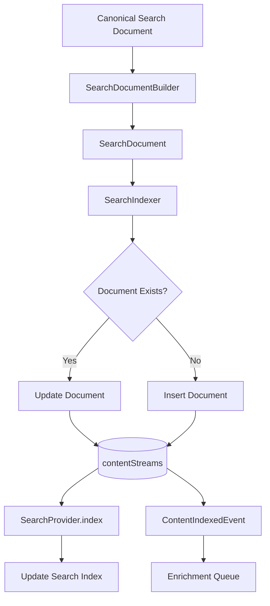

# 06 — Search Indexer

Status: 🟡 In Progress
Phase: Phase 1
Owner: Backend
Last Updated: 2026-07-28
Depends On: [05_Search_Provider](./05_Search_Provider.md)
Next Document: [07_Search_Document_Builder](./07_Search_Document_Builder.md)

---

## 1. Executive Summary

This document defines the SearchIndexer component, responsible for persisting search documents into `contentStreams`. The SearchIndexer handles upserts, deduplication, event emission, and integration with the enrichment pipeline.

The SearchIndexer is the bridge between the indexing pipeline (Platform Normalizers + SearchDocumentBuilder) and the storage layer (contentStreams + SearchProvider). It is also used during on-demand indexing (cache miss) to index content fetched from platform APIs.

---

## 2. Component Overview



---

## 3. Interface Definition

```typescript
interface ISearchIndexer {
  index(document: SearchDocument): Promise<void>;
  indexBatch(documents: SearchDocument[]): Promise<void>;
  update(document: SearchDocument): Promise<void>;
  delete(platform: string, externalId: string): Promise<void>;
  exists(platform: string, externalId: string): Promise<boolean>;
}
```

### 3.1 Method Signatures

| Method | Input | Output | Purpose |
|---|---|---|---|
| `index` | `SearchDocument` | `void` | Add or update a single document |
| `indexBatch` | `SearchDocument[]` | `void` | Add or update multiple documents |
| `update` | `SearchDocument` | `void` | Update an existing document |
| `delete` | `platform`, `externalId` | `void` | Remove a document |
| `exists` | `platform`, `externalId` | `boolean` | Check if document exists |

---

## 4. Implementation

### 4.1 Core Indexer

**File:** `src/infrastructure/search/searchIndexer.ts`

```typescript
@Injectable()
export class SearchIndexer implements ISearchIndexer {
  constructor(
    @Inject(_const.ICONTENTSTREAM_REPOSITORY)
    private readonly contentStreamRepository: IContentStreamRepository,
    @Inject(_const.ISEARCH_PROVIDER)
    private readonly searchProvider: ISearchProvider,
    private readonly eventEmitter: EventEmitter2,
  ) {}

  async index(document: SearchDocument): Promise<void> {
    // 1. Check if document exists
    const exists = await this.exists(document.platform, document.externalId);

    // 2. Persist to contentStreams
    if (exists) {
      await this.update(document);
    } else {
      await this.insert(document);
    }

    // 3. Index in search provider
    await this.searchProvider.index(document);

    // 4. Emit event
    this.eventEmitter.emit('content.indexed', {
      documentId: document.id,
      platform: document.platform,
      externalId: document.externalId,
      type: document.type,
      action: exists ? 'updated' : 'created',
      timestamp: new Date(),
    });

    // 5. Check if enrichment needed
    if (this.needsEnrichment(document)) {
      await this.enqueueEnrichment(document);
    }
  }
}
```

### 4.2 Insert Logic

```typescript
private async insert(document: SearchDocument): Promise<void> {
  const entity = new ContentStream({
    type: document.type,
    subType: document.subType,
    title: document.title,
    platform: document.platform,
    externalId: document.externalId,
    searchText: document.searchText,
    publishedAt: document.publishedAt,
    engagementScore: document.engagementScore,
    creatorId: document.creatorId,
    metaData: document.metaData,
    lastRefreshed: new Date(),
  });

  await this.contentStreamRepository.createAsync([entity]);
  document.id = entity.id;
}
```

### 4.3 Update Logic

```typescript
private async update(document: SearchDocument): Promise<void> {
  const existing = await this.contentStreamRepository.findByPlatformAndExternalIdAsync(
    document.platform,
    document.externalId
  );

  if (!existing) {
    throw new Error(`Document not found: ${document.platform}:${document.externalId}`);
  }

  // Merge updates
  existing.title = document.title || existing.title;
  existing.searchText = document.searchText || existing.searchText;
  existing.publishedAt = document.publishedAt || existing.publishedAt;
  existing.engagementScore = document.engagementScore ?? existing.engagementScore;
  existing.creatorId = document.creatorId || existing.creatorId;
  existing.metaData = { ...existing.metaData, ...document.metaData };
  existing.lastRefreshed = new Date();

  await this.contentStreamRepository.updateAsync(existing);
  document.id = existing.id;
}
```

### 4.4 Batch Indexing

```typescript
async indexBatch(documents: SearchDocument[]): Promise<void> {
  // 1. Check which documents exist
  const externalIds = documents.map(d => d.externalId);
  const platforms = [...new Set(documents.map(d => d.platform))];
  
  const existingIds = await this.contentStreamRepository.findExistingByPlatformAndExternalIdsAsync(
    platforms[0], // Assume single platform for batch
    externalIds
  );

  // 2. Split into inserts and updates
  const toInsert = documents.filter(d => !existingIds.includes(d.externalId));
  const toUpdate = documents.filter(d => existingIds.includes(d.externalId));

  // 3. Batch insert
  if (toInsert.length > 0) {
    const entities = toInsert.map(d => this.toEntity(d));
    await this.contentStreamRepository.createAsync(entities);
  }

  // 4. Batch update
  for (const doc of toUpdate) {
    await this.update(doc);
  }

  // 5. Index in search provider
  for (const doc of documents) {
    await this.searchProvider.index(doc);
  }

  // 6. Emit events
  for (const doc of documents) {
    this.eventEmitter.emit('content.indexed', {
      documentId: doc.id,
      platform: doc.platform,
      externalId: doc.externalId,
      type: doc.type,
      action: existingIds.includes(doc.externalId) ? 'updated' : 'created',
      timestamp: new Date(),
    });
  }
}
```

---

## 5. Deduplication

### 5.1 Platform + External ID

Documents are deduplicated by `platform` + `externalId`:

```typescript
async exists(platform: string, externalId: string): Promise<boolean> {
  return await this.contentStreamRepository.existsByPlatformAndExternalIdAsync(
    platform,
    externalId
  );
}
```

### 5.2 Idempotent Indexing

Indexing the same document twice produces the same result:

```typescript
// First index: INSERT
// Second index: UPDATE (no-op if nothing changed)
// Result: Same document, no duplicates
```

---

## 6. Event Emission

### 6.1 ContentIndexedEvent

```typescript
interface ContentIndexedEvent {
  documentId: string;
  platform: string;
  externalId: string;
  type: StreamEntityType;
  action: 'created' | 'updated';
  timestamp: Date;
}
```

### 6.2 Event Consumers

| Consumer | Event | Action |
|---|---|---|
| Enrichment Queue | `content.indexed` | Enqueue for metadata enrichment |
| Analytics | `content.indexed` | Track indexing metrics |
| Cache Invalidation | `content.indexed` | Invalidate search cache |

---

## 7. Enrichment Integration

### 7.1 Enrichment Check

```typescript
private needsEnrichment(document: SearchDocument): boolean {
  // Check if metadata is incomplete
  const requiredFields = ['viewCount', 'likeCount', 'commentCount'];
  return requiredFields.some(field => !document.metaData[field]);
}
```

### 7.2 Enqueue Enrichment

```typescript
private async enqueueEnrichment(document: SearchDocument): Promise<void> {
  await this.queueService.add('enrich-content', {
    documentId: document.id,
    platform: document.platform,
    externalId: document.externalId,
  }, {
    attempts: 3,
    backoff: { type: 'exponential', delay: 5000 },
  });
}
```

---

## 8. Error Handling

### 8.1 Insert Errors

```typescript
private async insert(document: SearchDocument): Promise<void> {
  try {
    await this.contentStreamRepository.createAsync([entity]);
  } catch (error) {
    if (error.code === '23505') { // Unique violation
      // Document was inserted concurrently, update instead
      await this.update(document);
    } else {
      throw error;
    }
  }
}
```

### 8.2 Search Provider Errors

```typescript
async index(document: SearchDocument): Promise<void> {
  // ... persist to contentStreams ...

  try {
    await this.searchProvider.index(document);
  } catch (error) {
    // Log but don't fail - contentStreams is source of truth
    logger.error('Failed to index in search provider', error);
  }
}
```

---

## 9. Performance Considerations

### 9.1 Batch Operations

Use batch operations for bulk imports:

```typescript
// Instead of:
for (const doc of documents) {
  await indexer.index(doc);
}

// Use:
await indexer.indexBatch(documents);
```

### 9.2 Connection Pooling

Reuse existing TypeORM connection pool. No new connections.

### 9.3 Memory Management

Process large batches in chunks:

```typescript
async indexBatch(documents: SearchDocument[]): Promise<void> {
  const chunkSize = 100;
  for (let i = 0; i < documents.length; i += chunkSize) {
    const chunk = documents.slice(i, i + chunkSize);
    await this.processChunk(chunk);
  }
}
```

---

## 10. Testing Strategy

### 10.1 Unit Tests

- Insert logic
- Update logic
- Deduplication
- Event emission
- Enrichment check

### 10.2 Integration Tests

- Full index lifecycle
- Batch indexing
- Concurrent indexing
- Error recovery

---

## 11. Related Documents

- [README](./README.md) — Entry point and architecture summary
- [05_Search_Provider](./05_Search_Provider.md) — SearchProvider interface
- [07_Search_Document_Builder](./07_Search_Document_Builder.md) — searchText generation
- [09_ContentStreams_Extension](./09_ContentStreams_Extension.md) — Schema changes
- [13_Background_Enrichment](./13_Background_Enrichment.md) — Enrichment pipeline
