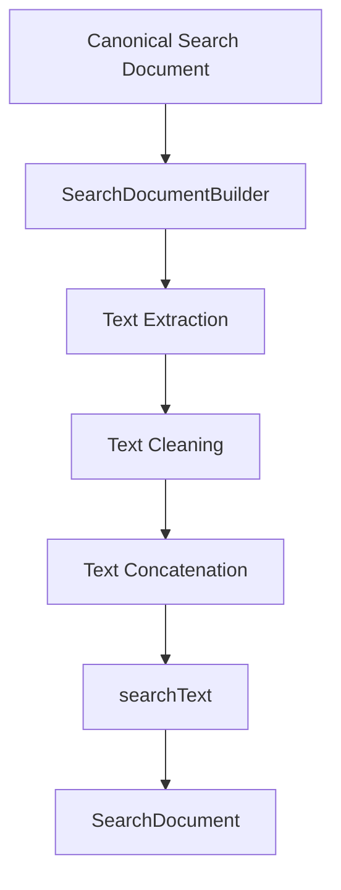

# 07 — Search Document Builder

Status: 🟡 In Progress
Phase: Phase 1
Owner: Backend
Last Updated: 2026-07-28
Depends On: [06_Search_Indexer](./06_Search_Indexer.md)
Next Document: [08_Ranking_Engine](./08_Ranking_Engine.md)

---

## 1. Executive Summary

This document defines the SearchDocumentBuilder component, responsible for generating `searchText` and preparing Canonical Search Documents for indexing. The builder concatenates, cleans, and normalizes text fields into a single searchable string.

The `searchText` field is generated in application code (NOT `GENERATED ALWAYS AS` in PostgreSQL) to allow future AI tags, OCR, transcripts, synonyms, and multilingual tokens.

---

## 2. Component Overview



---

## 3. Interface Definition

```typescript
interface ISearchDocumentBuilder {
  build(document: CanonicalSearchDocument): SearchDocument;
  generateSearchText(document: CanonicalSearchDocument): string;
  cleanText(text: string): string;
}
```

---

## 4. Implementation

### 4.1 Core Builder

**File:** `src/infrastructure/search/searchDocumentBuilder.ts`

```typescript
@Injectable()
export class SearchDocumentBuilder implements ISearchDocumentBuilder {
  build(document: CanonicalSearchDocument): SearchDocument {
    const searchText = this.generateSearchText(document);
    const engagementScore = this.calculateEngagementScore(document.engagement);

    return {
      id: '', // Set by SearchIndexer
      platform: document.platform,
      externalId: document.externalId,
      type: document.type,
      subType: document.subType,
      title: document.title,
      searchText,
      searchVector: '', // Generated by SearchProvider
      publishedAt: document.publishedAt,
      engagementScore,
      creatorId: document.creatorId,
      metaData: {
        ...document.platformMetadata,
        description: document.description,
        tags: document.tags,
        creatorName: document.creatorName,
        creatorAvatar: document.creatorAvatar,
        thumbnailUrl: document.thumbnailUrl,
        mediaUrl: document.mediaUrl,
        mediaType: document.mediaType,
        engagement: document.engagement,
      },
      lastRefreshed: new Date(),
      createdOn: new Date(),
      lastModifiedOn: new Date(),
    };
  }
}
```

### 4.2 searchText Generation

```typescript
generateSearchText(document: CanonicalSearchDocument): string {
  const parts = [
    document.title,
    document.description,
    ...(document.tags || []),
    document.creatorName,
  ];

  return parts
    .filter(Boolean)
    .map(part => this.cleanText(part))
    .join(' ')
    .trim();
}
```

### 4.3 Text Cleaning

```typescript
cleanText(text: string): string {
  return text
    // 1. Convert to lowercase
    .toLowerCase()
    // 2. Remove special characters (keep alphanumeric, spaces, hyphens)
    .replace(/[^a-z0-9\s-]/g, '')
    // 3. Normalize whitespace
    .replace(/\s+/g, ' ')
    // 4. Trim
    .trim();
}
```

### 4.4 Engagement Score Calculation

```typescript
private calculateEngagementScore(engagement: EngagementMetrics): number {
  if (!engagement) return 0;

  const viewWeight = 0.4;
  const likeWeight = 0.3;
  const commentWeight = 0.2;
  const subscriberWeight = 0.1;

  const viewScore = this.normalize(engagement.viewCount || 0, 10000000);
  const likeScore = this.normalize(engagement.likeCount || 0, 1000000);
  const commentScore = this.normalize(engagement.commentCount || 0, 100000);
  const subscriberScore = this.normalize(engagement.subscriberCount || 0, 10000000);

  return (
    viewScore * viewWeight +
    likeScore * likeWeight +
    commentScore * commentWeight +
    subscriberScore * subscriberWeight
  );
}

private normalize(value: number, max: number): number {
  return Math.min(value / max, 1);
}
```

---

## 5. Text Extraction by Platform

### 5.1 YouTube

```typescript
function extractYouTubeText(document: CanonicalSearchDocument): string {
  const parts = [
    document.title,                    // "How to Build a REST API"
    document.description,              // "In this tutorial..."
    ...(document.tags || []),          // ["nodejs", "typescript", "api"]
    document.creatorName,              // "Tech Academy"
  ];

  return parts.filter(Boolean).join(' ');
}
```

### 5.2 Facebook

```typescript
function extractFacebookText(document: CanonicalSearchDocument): string {
  const parts = [
    document.title,                    // Post message
    document.description,              // Same as title for posts
    document.creatorName,              // Page/Profile name
  ];

  return parts.filter(Boolean).join(' ');
}
```

### 5.3 Instagram

```typescript
function extractInstagramText(document: CanonicalSearchDocument): string {
  const parts = [
    document.title,                    // Caption
    document.description,              // Same as caption
    ...(document.tags || []),          // Hashtags
    document.creatorName,              // Username
  ];

  return parts.filter(Boolean).join(' ');
}
```

### 5.4 Pinterest

```typescript
function extractPinterestText(document: CanonicalSearchDocument): string {
  const parts = [
    document.title,                    // Pin title
    document.description,              // Pin description
    document.creatorName,              // Board owner name
  ];

  return parts.filter(Boolean).join(' ');
}
```

---

## 6. Future Enhancements

### 6.1 AI-Generated Tags

```typescript
// Future: AI tags added to searchText
const aiTags = await aiService.generateTags(document);
parts.push(...aiTags);
```

### 6.2 OCR Text

```typescript
// Future: OCR text from images/videos
const ocrText = await ocrService.extractText(document.thumbnailUrl);
parts.push(ocrText);
```

### 6.3 Transcript Text

```typescript
// Future: Transcripts from videos
const transcript = await transcriptService.getTranscript(document.externalId);
parts.push(transcript);
```

### 6.4 Synonyms

```typescript
// Future: Synonym expansion
const expandedTerms = await synonymService.expand(query);
parts.push(...expandedTerms);
```

### 6.5 Multilingual Tokens

```typescript
// Future: Language-specific tokenization
const tokens = await tokenizer.tokenize(text, document.language);
parts.push(...tokens);
```

---

## 7. Performance Considerations

### 7.1 Caching

Cache `searchText` generation for identical documents:

```typescript
private cache = new Map<string, string>();

generateSearchText(document: CanonicalSearchDocument): string {
  const key = `${document.platform}:${document.externalId}`;
  if (this.cache.has(key)) {
    return this.cache.get(key);
  }

  const searchText = this.buildSearchText(document);
  this.cache.set(key, searchText);
  return searchText;
}
```

### 7.2 Batch Processing

Process multiple documents efficiently:

```typescript
buildBatch(documents: CanonicalSearchDocument[]): SearchDocument[] {
  return documents.map(doc => this.build(doc));
}
```

---

## 8. Testing Strategy

### 8.1 Unit Tests

- Text cleaning
- searchText generation
- Engagement score calculation
- Platform-specific extraction

### 8.2 Integration Tests

- Full build pipeline
- Batch building
- Edge cases (empty fields, special characters)

---

## 9. Related Documents

- [README](./README.md) — Entry point and architecture summary
- [03_Search_Domain_Model](./03_Search_Domain_Model.md) — Domain model definitions
- [06_Search_Indexer](./06_Search_Indexer.md) — SearchIndexer implementation
- [08_Ranking_Engine](./08_Ranking_Engine.md) — Ranking formulas
- [23_Future_AI_Search](./23_Future_AI_Search.md) — AI search features
