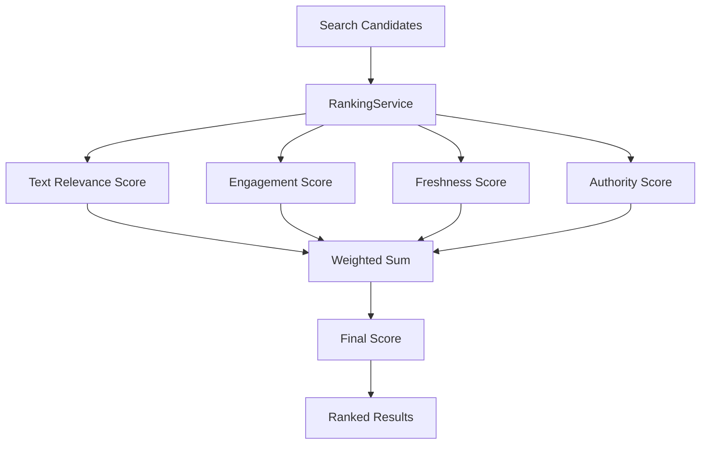

# 08 — Ranking Engine

Status: 🟡 In Progress
Phase: Phase 1
Owner: Backend
Last Updated: 2026-07-28
Depends On: [03_Search_Domain_Model](./03_Search_Domain_Model.md)
Next Document: [09_ContentStreams_Extension](./09_ContentStreams_Extension.md)

---

## 1. Executive Summary

This document defines the RankingService component, responsible for scoring and ordering search candidates. The ranking engine combines four signals with configurable weights: text relevance, engagement, freshness, and creator authority.

Ranking is separate from retrieval. The search engine returns candidates. Ranking is a separate service that can be upgraded independently without changing the search provider.

---

## 2. Component Overview



---

## 3. Interface Definition

```typescript
interface IRankingService {
  rank(candidates: SearchCandidate[], query: SearchQuery): SearchResult[];
  configure(config: RankingConfig): void;
}

interface RankingConfig {
  textWeight: number;      // Default: 0.40
  engagementWeight: number; // Default: 0.25
  freshnessWeight: number; // Default: 0.20
  authorityWeight: number; // Default: 0.10
  platformWeight: number;  // Default: 0.05
}
```

---

## 4. Implementation

### 4.1 Core Ranker

**File:** `src/infrastructure/search/rankingService.ts`

```typescript
@Injectable()
export class RankingService implements IRankingService {
  private config: RankingConfig = {
    textWeight: 0.40,
    engagementWeight: 0.25,
    freshnessWeight: 0.20,
    authorityWeight: 0.10,
    platformWeight: 0.05,
  };

  rank(candidates: SearchCandidate[], query: SearchQuery): SearchResult[] {
    const scored = candidates.map(candidate => ({
      ...this.toResult(candidate),
      score: this.calculateScore(candidate),
    }));

    return scored.sort((a, b) => b.score - a.score);
  }

  private calculateScore(candidate: SearchCandidate): number {
    const textScore = this.calculateTextScore(candidate);
    const engagementScore = this.calculateEngagementScore(candidate);
    const freshnessScore = this.calculateFreshnessScore(candidate);
    const authorityScore = this.calculateAuthorityScore(candidate);
    const platformScore = this.calculatePlatformScore(candidate);

    return (
      textScore * this.config.textWeight +
      engagementScore * this.config.engagementWeight +
      freshnessScore * this.config.freshnessWeight +
      authorityScore * this.config.authorityWeight +
      platformScore * this.config.platformWeight
    );
  }
}
```

### 4.2 Text Relevance Score

```typescript
private calculateTextScore(candidate: SearchCandidate): number {
  // Combine ts_rank and pg_trgm similarity
  const tsRank = candidate.textRelevance;    // 0-1 from ts_rank
  const similarity = candidate.textSimilarity; // 0-1 from pg_trgm
  const exactMatch = candidate.exactMatch ? 0.2 : 0;

  // Weighted combination
  return (tsRank * 0.7 + similarity * 0.3) + exactMatch;
}
```

### 4.3 Engagement Score

```typescript
private calculateEngagementScore(candidate: SearchCandidate): number {
  const engagement = candidate.document.metaData?.engagement;
  if (!engagement) return 0;

  // Use pre-computed engagementScore if available
  if (candidate.document.engagementScore) {
    return candidate.document.engagementScore;
  }

  // Calculate on-the-fly
  const viewWeight = 0.4;
  const likeWeight = 0.3;
  const commentWeight = 0.2;
  const subscriberWeight = 0.1;

  const viewScore = this.normalize(engagement.viewCount || 0, 10000000);
  const likeScore = this.normalize(engagement.likeCount || 0, 1000000);
  const commentScore = this.normalize(engagement.commentCount || 0, 100000);
  const subscriberScore = this.normalize(engagement.subscriberCount || 0, 10000000);

  return (
    viewScore * viewWeight +
    likeScore * likeWeight +
    commentScore * commentWeight +
    subscriberScore * subscriberWeight
  );
}
```

### 4.4 Freshness Score

```typescript
private calculateFreshnessScore(candidate: SearchCandidate): number {
  const publishedAt = candidate.document.publishedAt;
  if (!publishedAt) return 0;

  const now = new Date();
  const ageInDays = (now.getTime() - new Date(publishedAt).getTime()) / (1000 * 60 * 60 * 24);

  // Exponential decay: score = e^(-ageInDays / 30)
  // Content loses ~50% score after 30 days
  return Math.exp(-ageInDays / 30);
}
```

### 4.5 Authority Score

```typescript
private calculateAuthorityScore(candidate: SearchCandidate): number {
  const creatorId = candidate.document.creatorId;
  if (!creatorId) return 0;

  // Get creator subscriber count from metadata
  const subscriberCount = candidate.document.metaData?.engagement?.subscriberCount || 0;

  // Logarithmic scale: score = log(1 + subscriberCount) / log(1 + MAX_SUBSCRIBERS)
  const MAX_SUBSCRIBERS = 10000000; // 10M
  return Math.log(1 + subscriberCount) / Math.log(1 + MAX_SUBSCRIBERS);
}
```

### 4.6 Platform Score

```typescript
private calculatePlatformScore(candidate: SearchCandidate): number {
  const platformWeights: Record<string, number> = {
    youtube: 1.0,
    facebook: 0.9,
    instagram: 0.9,
    pinterest: 0.8,
    reddit: 0.8,
    spotify: 0.7,
    twitter: 0.9,
    linkedin: 0.7,
    tiktok: 0.9,
    snapchat: 0.6,
    threads: 0.7,
    behance: 0.6,
  };

  return platformWeights[candidate.document.platform] || 0.5;
}
```

---

## 5. Configuration

### 5.1 Default Configuration

```typescript
const defaultConfig: RankingConfig = {
  textWeight: 0.40,
  engagementWeight: 0.25,
  freshnessWeight: 0.20,
  authorityWeight: 0.10,
  platformWeight: 0.05,
};
```

### 5.2 Dynamic Configuration

```typescript
configure(config: RankingConfig): void {
  // Validate weights sum to 1.0
  const sum = config.textWeight + config.engagementWeight + 
              config.freshnessWeight + config.authorityWeight + config.platformWeight;
  
  if (Math.abs(sum - 1.0) > 0.001) {
    throw new Error(`Ranking weights must sum to 1.0, got ${sum}`);
  }

  this.config = config;
}
```

### 5.3 A/B Testing

```typescript
// Test different ranking weights
const configs = {
  control: { textWeight: 0.40, engagementWeight: 0.25, freshnessWeight: 0.20, authorityWeight: 0.10, platformWeight: 0.05 },
  experiment1: { textWeight: 0.50, engagementWeight: 0.20, freshnessWeight: 0.20, authorityWeight: 0.05, platformWeight: 0.05 },
  experiment2: { textWeight: 0.30, engagementWeight: 0.30, freshnessWeight: 0.20, authorityWeight: 0.15, platformWeight: 0.05 },
};
```

---

## 6. Normalization

### 6.1 Value Normalization

```typescript
private normalize(value: number, max: number): number {
  return Math.min(value / max, 1);
}
```

### 6.2 Score Normalization

```typescript
private normalizeScores(results: SearchResult[]): SearchResult[] {
  const maxScore = Math.max(...results.map(r => r.score));
  if (maxScore === 0) return results;

  return results.map(r => ({
    ...r,
    score: r.score / maxScore,
  }));
}
```

---

## 7. Special Cases

### 7.1 No Results

```typescript
if (candidates.length === 0) {
  return [];
}
```

### 7.2 Single Result

```typescript
if (candidates.length === 1) {
  return [this.toResult(candidates[0])];
}
```

### 7.3 All Same Score

```typescript
// If all results have the same score, sort by freshness
const allSameScore = results.every(r => r.score === results[0].score);
if (allSameScore) {
  return results.sort((a, b) => 
    new Date(b.publishedAt).getTime() - new Date(a.publishedAt).getTime()
  );
}
```

---

## 8. Performance Considerations

### 8.1 Pre-computed Scores

Pre-compute `engagementScore` at index time to avoid recalculation at query time.

### 8.2 Caching

Cache ranking results for identical queries:

```typescript
private cache = new Map<string, SearchResult[]>();

rank(candidates: SearchCandidate[], query: SearchQuery): SearchResult[] {
  const key = this.getCacheKey(query);
  if (this.cache.has(key)) {
    return this.cache.get(key);
  }

  const results = this.computeRanking(candidates);
  this.cache.set(key, results);
  return results;
}
```

### 8.3 Batch Processing

Process multiple candidates efficiently:

```typescript
rankBatch(candidatesBatch: SearchCandidate[][], queries: SearchQuery[]): SearchResult[][] {
  return candidatesBatch.map((candidates, i) => this.rank(candidates, queries[i]));
}
```

---

## 9. Testing Strategy

### 9.1 Unit Tests

- Score calculation for each signal
- Weight application
- Normalization
- Edge cases

### 9.2 Integration Tests

- Full ranking pipeline
- Different configurations
- A/B test scenarios

### 9.3 Performance Tests

- 1000 candidates ranking
- Cache hit/miss scenarios

---

## 10. Related Documents

- [README](./README.md) — Entry point and architecture summary
- [03_Search_Domain_Model](./03_Search_Domain_Model.md) — Domain model definitions
- [04_Search_Query_Pipeline](./04_Search_Query_Pipeline.md) — Query lifecycle
- [07_Search_Document_Builder](./07_Search_Document_Builder.md) — searchText generation
- [23_Future_AI_Search](./23_Future_AI_Search.md) — AI ranking features
