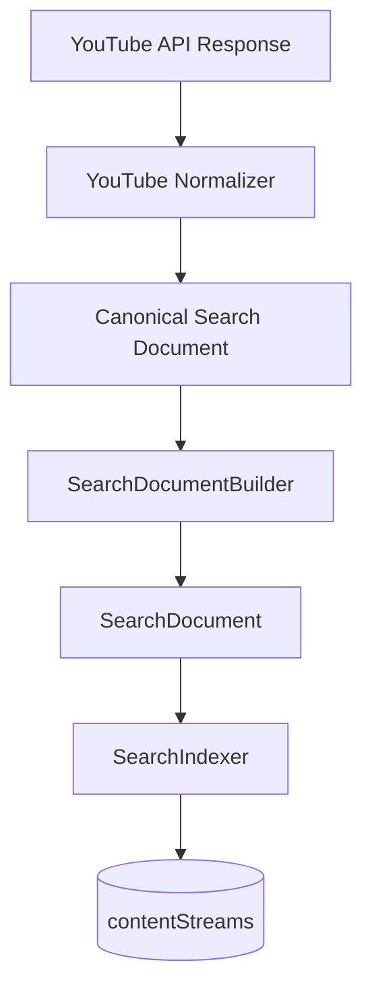

# 11 — YouTube Normalizer

Status: 🟡 In Progress
Phase: Phase 1
Owner: Backend
Last Updated: 2026-07-28
Depends On: [10_Postgres_Search](./10_Postgres_Search.md)
Next Document: [12_YouTube_Import_Pipeline](./12_YouTube_Import_Pipeline.md)

---

## 1. Executive Summary

This document defines the YouTube Platform Normalizer, responsible for mapping YouTube Data API v3 responses to Canonical Search Documents. The normalizer handles videos, channels, and playlists, extracting engagement metrics, creator information, and metadata.

The normalizer is the first platform implementation, establishing the pattern for Facebook, Instagram, and Pinterest normalizers.

---

## 2. Component Overview



---

## 3. Interface Definition

```typescript
interface IYouTubeNormalizer {
  normalizeVideo(item: YouTubeVideoItem): CanonicalSearchDocument;
  normalizeChannel(item: YouTubeChannelItem): CanonicalSearchDocument;
  normalizePlaylist(item: YouTubePlaylistItem): CanonicalSearchDocument;
  normalizeBatch(items: YouTubeSearchResultItem[]): CanonicalSearchDocument[];
}
```

---

## 4. Implementation

### 4.1 Core Normalizer

**File:** `src/infrastructure/search/platform-normalizers/youtubeNormalizer.ts`

```typescript
@Injectable()
export class YouTubeNormalizer implements IYouTubeNormalizer {
  normalizeVideo(item: YouTubeVideoItem): CanonicalSearchDocument {
    return {
      platform: 'youtube',
      externalId: item.id.videoId,
      type: StreamEntityType.Content,
      subType: 'video',
      title: item.snippet.title,
      description: item.snippet.description,
      tags: item.snippet.tags || [],
      creatorId: item.snippet.channelId,
      creatorName: item.snippet.channelTitle,
      creatorAvatar: '', // Requires channels.list API call
      thumbnailUrl: item.snippet.thumbnails?.default?.url || '',
      mediaUrl: `https://www.youtube.com/watch?v=${item.id.videoId}`,
      mediaType: 'video',
      publishedAt: new Date(item.snippet.publishedAt),
      importedAt: new Date(),
      engagement: {
        viewCount: 0,    // Requires videos.list API call
        likeCount: 0,    // Requires videos.list API call
        commentCount: 0, // Requires videos.list API call
        subscriberCount: 0, // Requires channels.list API call
      },
      platformMetadata: {
        channelId: item.snippet.channelId,
        channelTitle: item.snippet.channelTitle,
        thumbnails: item.snippet.thumbnails,
        liveBroadcastContent: item.snippet.liveBroadcastContent,
      },
    };
  }
}
```

### 4.2 Channel Normalization

```typescript
normalizeChannel(item: YouTubeChannelItem): CanonicalSearchDocument {
  return {
    platform: 'youtube',
    externalId: item.id.channelId,
    type: StreamEntityType.Profile,
    subType: 'channel',
    title: item.snippet.title,
    description: item.snippet.description,
    tags: [],
    creatorId: item.id.channelId,
    creatorName: item.snippet.title,
    creatorAvatar: item.snippet.thumbnails?.default?.url || '',
    thumbnailUrl: item.snippet.thumbnails?.default?.url || '',
    mediaUrl: `https://www.youtube.com/channel/${item.id.channelId}`,
    mediaType: 'channel',
    publishedAt: new Date(item.snippet.publishedAt),
    importedAt: new Date(),
    engagement: {
      subscriberCount: 0, // Requires channels.list API call
    },
    platformMetadata: {
      thumbnails: item.snippet.thumbnails,
      country: item.snippet.country,
    },
  };
}
```

### 4.3 Playlist Normalization

```typescript
normalizePlaylist(item: YouTubePlaylistItem): CanonicalSearchDocument {
  return {
    platform: 'youtube',
    externalId: item.id.playlistId,
    type: StreamEntityType.Content,
    subType: 'playlist',
    title: item.snippet.title,
    description: item.snippet.description,
    tags: [],
    creatorId: item.snippet.channelId,
    creatorName: item.snippet.channelTitle,
    creatorAvatar: '',
    thumbnailUrl: item.snippet.thumbnails?.default?.url || '',
    mediaUrl: `https://www.youtube.com/playlist?list=${item.id.playlistId}`,
    mediaType: 'playlist',
    publishedAt: new Date(item.snippet.publishedAt),
    importedAt: new Date(),
    engagement: {
      viewCount: 0, // Requires playlists.list API call
    },
    platformMetadata: {
      channelId: item.snippet.channelId,
      channelTitle: item.snippet.channelTitle,
      thumbnails: item.snippet.thumbnails,
    },
  };
}
```

### 4.4 Batch Normalization

```typescript
normalizeBatch(items: YouTubeSearchResultItem[]): CanonicalSearchDocument[] {
  return items
    .filter(item => item.id?.kind && item.id?.videoId || item.id?.channelId || item.id?.playlistId)
    .map(item => {
      switch (item.id.kind) {
        case 'youtube#video':
          return this.normalizeVideo(item);
        case 'youtube#channel':
          return this.normalizeChannel(item);
        case 'youtube#playlist':
          return this.normalizePlaylist(item);
        default:
          return null;
      }
    })
    .filter(Boolean);
}
```

---

## 5. Field Mapping

### 5.1 Search Result Item to Canonical Search Document

| YouTube Field | Canonical Field | Notes |
|---|---|---|
| `id.kind` | `type`, `subType` | Maps to Profile/Content |
| `id.videoId` | `externalId` | Video ID |
| `id.channelId` | `externalId`, `creatorId` | Channel ID |
| `id.playlistId` | `externalId` | Playlist ID |
| `snippet.title` | `title` | Display title |
| `snippet.description` | `description` | Full description |
| `snippet.tags` | `tags` | Video tags |
| `snippet.channelId` | `creatorId` | Channel ID |
| `snippet.channelTitle` | `creatorName` | Channel name |
| `snippet.thumbnails.default.url` | `thumbnailUrl` | Thumbnail URL |
| `snippet.publishedAt` | `publishedAt` | Publication date |
| `snippet.liveBroadcastContent` | `platformMetadata.liveBroadcastContent` | Live status |

### 5.2 Videos.list Response (Background Enrichment)

| YouTube Field | Canonical Field | Notes |
|---|---|---|
| `statistics.viewCount` | `engagement.viewCount` | View count |
| `statistics.likeCount` | `engagement.likeCount` | Like count |
| `statistics.commentCount` | `engagement.commentCount` | Comment count |
| `contentDetails.duration` | `platformMetadata.duration` | Video duration |
| `topicDetails.topicCategories` | `tags` | Topic categories |

### 5.3 Channels.list Response (Background Enrichment)

| YouTube Field | Canonical Field | Notes |
|---|---|---|
| `statistics.subscriberCount` | `engagement.subscriberCount` | Subscriber count |
| `statistics.videoCount` | `platformMetadata.videoCount` | Video count |
| `snippet.country` | `platformMetadata.country` | Country |

---

## 6. Data Enrichment

### 6.1 Initial Import (search.list)

The `search.list` API provides minimal data:

```json
{
  "kind": "youtube#searchResult",
  "id": {
    "kind": "youtube#video",
    "videoId": "dQw4w9WgXcQ"
  },
  "snippet": {
    "publishedAt": "2026-07-28T12:00:00Z",
    "channelId": "UCuAXFkgsw1L7xaCfnd5JJOw",
    "title": "How to Build a REST API",
    "description": "In this tutorial...",
    "thumbnails": {
      "default": {
        "url": "https://i.ytimg.com/vi/dQw4w9WgXcQ/default.jpg"
      }
    },
    "channelTitle": "Tech Academy",
    "tags": ["nodejs", "typescript", "api"],
    "liveBroadcastContent": "none"
  }
}
```

**Missing fields:** `viewCount`, `likeCount`, `commentCount`, `duration`, `subscriberCount`

### 6.2 Background Enrichment (videos.list)

The `videos.list` API provides detailed statistics:

```json
{
  "kind": "youtube#videoListResponse",
  "items": [{
    "id": "dQw4w9WgXcQ",
    "statistics": {
      "viewCount": "1234567",
      "likeCount": "12345",
      "commentCount": "678"
    },
    "contentDetails": {
      "duration": "PT15M30S"
    }
  }]
}
```

**Cost:** 1 unit per call (up to 50 IDs per call)

---

## 7. Error Handling

### 7.1 Invalid Items

```typescript
normalizeBatch(items: YouTubeSearchResultItem[]): CanonicalSearchDocument[] {
  return items
    .map(item => {
      try {
        return this.normalizeItem(item);
      } catch (error) {
        logger.warn(`Failed to normalize YouTube item: ${item.id?.videoId}`, error);
        return null;
      }
    })
    .filter(Boolean);
}
```

### 7.2 Missing Fields

```typescript
normalizeVideo(item: YouTubeVideoItem): CanonicalSearchDocument {
  return {
    // ... required fields ...
    title: item.snippet?.title || 'Untitled',
    description: item.snippet?.description || '',
    tags: item.snippet?.tags || [],
    // ... etc ...
  };
}
```

---

## 8. Performance Considerations

### 8.1 Batch Processing

Process multiple items efficiently:

```typescript
normalizeBatch(items: YouTubeSearchResultItem[]): CanonicalSearchDocument[] {
  return items.map(item => this.normalizeItem(item));
}
```

### 8.2 Caching

Cache normalized documents to avoid re-processing:

```typescript
private cache = new Map<string, CanonicalSearchDocument>();

normalizeVideo(item: YouTubeVideoItem): CanonicalSearchDocument {
  const key = `youtube:video:${item.id.videoId}`;
  if (this.cache.has(key)) {
    return this.cache.get(key);
  }

  const doc = this.doNormalizeVideo(item);
  this.cache.set(key, doc);
  return doc;
}
```

---

## 9. Testing Strategy

### 9.1 Unit Tests

- Video normalization
- Channel normalization
- Playlist normalization
- Batch normalization
- Error handling

### 9.2 Integration Tests

- Full normalization pipeline
- Batch processing
- Edge cases (empty items, missing fields)

---

## 10. Related Documents

- [README](./README.md) — Entry point and architecture summary
- [03_Search_Domain_Model](./03_Search_Domain_Model.md) — Domain model definitions
- [12_YouTube_Import_Pipeline](./12_YouTube_Import_Pipeline.md) — Import pipeline
- [13_Background_Enrichment](./13_Background_Enrichment.md) — Enrichment pipeline
