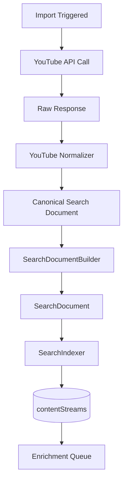

# 12 — YouTube Import Pipeline

Status: 🟡 In Progress
Phase: Phase 1
Owner: Backend
Last Updated: 2026-07-28
Depends On: [11_YouTube_Normalizer](./11_YouTube_Normalizer.md)
Next Document: [13_Background_Enrichment](./13_Background_Enrichment.md)

---

## 1. Executive Summary

This document defines the YouTube import pipeline, responsible for fetching content from YouTube Data API v3, normalizing it via YouTube Normalizer, and indexing it into contentStreams. The pipeline integrates with the existing BullMQ job queue and YouTube import service.

Import events trigger search indexing. No polling, no scheduled batch jobs for search document creation.

---

## 2. Pipeline Overview



---

## 3. Integration Points

### 3.1 Existing Import Service

**File:** `src/infrastructure/services/youtube/youtube-imports.service.ts`

The existing `YoutubeImportService.importFullAsync` method handles YouTube imports. The unified search system hooks into this method to trigger indexing.

### 3.2 BullMQ Processor

**File:** `src/infrastructure/background/processors/youtube-import.processor.ts`

The existing `YoutubeImportProcessor` processes YouTube import jobs. The unified search system adds indexing steps to this processor.

---

## 4. Implementation

### 4.1 Import Hook

> **Update (2026-07-31):** the `SEARCH_UNIFIED_ENABLED` guard was removed.
> `indexImportedContent(saved)` runs unconditionally after every successful
> import and writes through `ContentStreamIndexService.indexBatch()`, the single
> canonical write path for all upstream search results.

```typescript
// In YoutubeImportService
async importFullAsync(account: any, accessToken: string, job: Job): Promise<void> {
  // ... existing import logic ...

  // After importing content, index in unified search (always on)
  await this.indexImportedContent(content, accessToken);
}

private async indexImportedContent(content: any, accessToken: string): Promise<void> {
  // 1. Normalize via YouTube Normalizer
  const canonicalDoc = this.youtubeNormalizer.normalizeVideo(content);

  // 2. Build search document
  const searchDoc = this.searchDocumentBuilder.build(canonicalDoc);

  // 3. Index in contentStreams
  await this.searchIndexer.index(searchDoc);
}
```

### 4.2 Batch Indexing

```typescript
async indexBatch(items: YouTubeSearchResultItem[]): Promise<void> {
  // 1. Normalize batch
  const canonicalDocs = this.youtubeNormalizer.normalizeBatch(items);

  // 2. Build search documents
  const searchDocs = canonicalDocs.map(doc => this.searchDocumentBuilder.build(doc));

  // 3. Index batch
  await this.searchIndexer.indexBatch(searchDocs);
}
```

---

## 5. Quota Management

### 5.1 search.list Quota

- Cost: 100 units per call
- Daily limit: 10,000 units
- Maximum: 100 searches per day

### 5.2 videos.list Quota

- Cost: 1 unit per call (up to 50 IDs)
- Daily limit: 10,000 units
- Maximum: 10,000 calls per day (500,000 videos)

### 5.3 channels.list Quota

- Cost: 1 unit per call (up to 50 IDs)
- Daily limit: 10,000 units
- Maximum: 10,000 calls per day (500,000 channels)

---

## 6. Error Handling

### 6.1 API Errors

```typescript
try {
  const response = await axios.get('https://www.googleapis.com/youtube/v3/search', { params });
  return response.data;
} catch (error) {
  if (error.response?.status === 403) {
    logger.error('YouTube API quota exceeded');
    throw new QuotaExceededError('YouTube API quota exceeded');
  }
  throw error;
}
```

### 6.2 Normalization Errors

```typescript
try {
  const canonicalDoc = this.youtubeNormalizer.normalizeVideo(item);
} catch (error) {
  logger.warn(`Failed to normalize YouTube item: ${item.id?.videoId}`, error);
  return null; // Skip invalid items
}
```

---

## 7. Monitoring

### 7.1 Metrics

| Metric | Description | Target |
|---|---|---|
| `youtube.import.items` | Items imported per job | Varies |
| `youtube.import.duration` | Import job duration | < 60s |
| `youtube.import.errors` | Import errors | < 1% |
| `youtube.import.indexed` | Items indexed in unified search | = items imported |

---

## 8. Related Documents

- [README](./README.md) — Entry point and architecture summary
- [11_YouTube_Normalizer](./11_YouTube_Normalizer.md) — YouTube normalizer
- [13_Background_Enrichment](./13_Background_Enrichment.md) — Enrichment pipeline
- [14_Background_Refresh](./14_Background_Refresh.md) — Refresh pipeline
