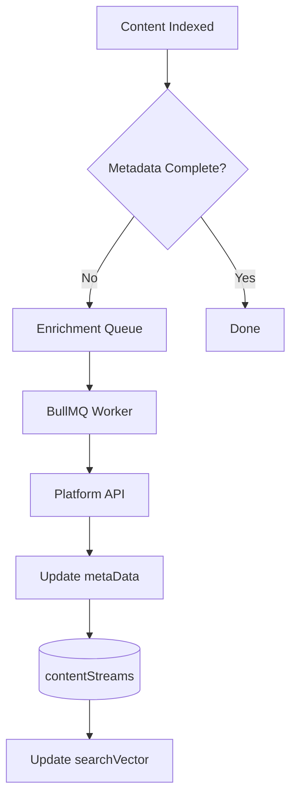

# 13 — Background Enrichment

Status: 🟡 In Progress
Phase: Phase 1
Owner: Backend
Last Updated: 2026-07-28
Depends On: [12_YouTube_Import_Pipeline](./12_YouTube_Import_Pipeline.md)
Next Document: [14_Background_Refresh](./14_Background_Refresh.md)

---

## 1. Executive Summary

This document defines the background enrichment pipeline, responsible for adding detailed metadata (view count, duration, tags) to indexed documents after initial import. The pipeline uses BullMQ jobs to fetch data from platform APIs and update contentStreams.

Enrichment is triggered after initial indexing when metadata is incomplete.

---

## 2. Pipeline Overview



---

## 3. Enrichment Check

### 3.1 YouTube Videos

```typescript
function needsYouTubeEnrichment(document: SearchDocument): boolean {
  const requiredFields = ['viewCount', 'likeCount', 'commentCount', 'duration'];
  return requiredFields.some(field => !document.metaData[field]);
}
```

### 3.2 YouTube Channels

```typescript
function needsYouTubeChannelEnrichment(document: SearchDocument): boolean {
  const requiredFields = ['subscriberCount', 'videoCount'];
  return requiredFields.some(field => !document.metaData[field]);
}
```

---

## 4. BullMQ Job

### 4.1 Job Data

```typescript
interface EnrichmentJobData {
  documentId: string;
  platform: string;
  externalId: string;
  subType: string;
}
```

### 4.2 Job Processor

```typescript
@Processor('enrich-content', BullMQConfig.getWorkerOptions('enrich-content', 1))
export class EnrichmentProcessor extends WorkerHost {
  async process(job: Job<EnrichmentJobData>): Promise<void> {
    const { documentId, platform, externalId, subType } = job.data;

    switch (platform) {
      case 'youtube':
        if (subType === 'video') {
          await this.enrichYouTubeVideo(documentId, externalId);
        } else if (subType === 'channel') {
          await this.enrichYouTubeChannel(documentId, externalId);
        }
        break;
      // Add other platforms as needed
    }
  }
}
```

---

## 5. YouTube Enrichment

### 5.1 Video Enrichment

```typescript
async enrichYouTubeVideo(documentId: string, videoId: string): Promise<void> {
  // 1. Fetch video details
  const response = await axios.get('https://www.googleapis.com/youtube/v3/videos', {
    params: {
      part: 'statistics,contentDetails',
      id: videoId,
      key: configs.youtube.apiKey,
    },
  });

  const video = response.data.items[0];
  if (!video) return;

  // 2. Update metaData
  await this.contentStreamRepository.updateAsync(documentId, {
    metaData: {
      viewCount: parseInt(video.statistics.viewCount) || 0,
      likeCount: parseInt(video.statistics.likeCount) || 0,
      commentCount: parseInt(video.statistics.commentCount) || 0,
      duration: video.contentDetails.duration,
    },
    engagementScore: this.calculateEngagementScore(video.statistics),
  });

  // 3. Update searchVector
  await this.searchProvider.update({
    id: documentId,
    // ... updated fields
  });
}
```

### 5.2 Channel Enrichment

```typescript
async enrichYouTubeChannel(documentId: string, channelId: string): Promise<void> {
  // 1. Fetch channel details
  const response = await axios.get('https://www.googleapis.com/youtube/v3/channels', {
    params: {
      part: 'statistics',
      id: channelId,
      key: configs.youtube.apiKey,
    },
  });

  const channel = response.data.items[0];
  if (!channel) return;

  // 2. Update metaData
  await this.contentStreamRepository.updateAsync(documentId, {
    metaData: {
      subscriberCount: parseInt(channel.statistics.subscriberCount) || 0,
      videoCount: parseInt(channel.statistics.videoCount) || 0,
    },
    engagementScore: this.calculateAuthorityScore(channel.statistics),
  });
}
```

---

## 6. Batch Enrichment

### 6.1 Batch Video Enrichment

```typescript
async enrichYouTubeVideos(videoIds: string[]): Promise<void> {
  // Batch up to 50 IDs per call
  const batchSize = 50;
  for (let i = 0; i < videoIds.length; i += batchSize) {
    const batch = videoIds.slice(i, i + batchSize);
    await this.enrichYouTubeVideoBatch(batch);
  }
}
```

### 6.2 Quota Optimization

- Batch 50 IDs per `videos.list` call (1 unit per call)
- Process 500,000 videos per day with 10,000 unit quota
- Prioritize recently imported content

---

## 7. Error Handling

### 7.1 API Errors

```typescript
try {
  await this.enrichYouTubeVideo(documentId, videoId);
} catch (error) {
  if (error.response?.status === 403) {
    logger.error('YouTube API quota exceeded');
    // Retry later
    throw new RetryableError('Quota exceeded');
  }
  throw error;
}
```

### 7.2 Retry Logic

```typescript
@Processor('enrich-content', BullMQConfig.getWorkerOptions('enrich-content', 1, {
  attempts: 3,
  backoff: { type: 'exponential', delay: 5000 },
}))
```

---

## 8. Monitoring

### 8.1 Metrics

| Metric | Description | Target |
|---|---|---|
| `enrichment.queue.length` | Jobs in queue | < 1000 |
| `enrichment.processed` | Jobs processed per hour | Varies |
| `enrichment.errors` | Job failures | < 1% |
| `enrichment.duration` | Average job duration | < 5s |

---

## 9. Related Documents

- [README](./README.md) — Entry point and architecture summary
- [09_ContentStreams_Extension](./09_ContentStreams_Extension.md) — Schema changes
- [12_YouTube_Import_Pipeline](./12_YouTube_Import_Pipeline.md) — Import pipeline
- [14_Background_Refresh](./14_Background_Refresh.md) — Refresh pipeline
