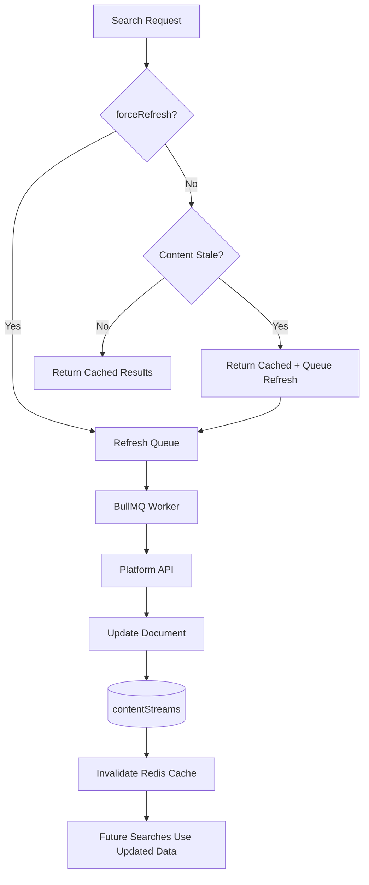

# 14 — Background Refresh

Status: 🟡 In Progress
Phase: Phase 1
Owner: Backend
Last Updated: 2026-07-28
Depends On: [13_Background_Enrichment](./13_Background_Enrichment.md)
Next Document: [15_Search_API_Refactor](./15_Search_API_Refactor.md)

---

## 1. Executive Summary

This document defines the background refresh pipeline, responsible for updating stale documents with fresh data from platform APIs. The system uses a **lazy, on-demand refresh strategy** — content is only refreshed when searched and stale, not on a periodic schedule.

**Refresh is NEVER scheduled.** No weekly refresh, no periodic polling, no automatic platform crawling. Refresh occurs only when:

1. `forceRefresh=true` in search request
2. Content exceeds freshness threshold AND is searched again
3. Content owner performs a new import
4. Manual administrative refresh

**Redis Invalidation:** After updating contentStreams, the refresh pipeline invalidates Redis cache entries for affected queries to ensure subsequent searches return fresh data.

---

## 2. Pipeline Overview

### 2.1 Lazy Refresh Flow



### 2.2 Refresh Triggers

| Trigger | Condition | Priority |
|---|---|---|
| `forceRefresh=true` | User or admin explicitly requests fresh data | High |
| Staleness threshold exceeded | `lastRefreshed < NOW() - INTERVAL '24 hours'` AND content is searched | Medium |
| Content owner import | User imports new content via platform integration | High |
| Administrative refresh | Admin manually triggers refresh via dashboard | High |

> **Important**
>
> Searching itself must never block waiting for refreshes. Stale results are returned immediately, and refresh happens asynchronously in the background. This ensures sub-100ms search latency even when content is stale.

---

## 3. Staleness Detection

### 3.1 Staleness Threshold

```typescript
const STALENESS_THRESHOLD_MS = 24 * 60 * 60 * 1000; // 24 hours

function isStale(lastRefreshed: Date): boolean {
  return Date.now() - new Date(lastRefreshed).getTime() > STALENESS_THRESHOLD_MS;
}
```

### 3.2 Check Staleness During Search

```typescript
async searchWithRefresh(query: SearchQuery): Promise<SearchCandidate[]> {
  // 1. Search the corpus
  const candidates = await this.searchProvider.search(query);

  if (candidates.length === 0) {
    // Cache miss → on-demand indexing (see 04_Search_Query_Pipeline.md)
    return this.onDemandIndex(query);
  }

  // 2. Check if any results are stale
  const staleCandidates = candidates.filter(c => 
    isStale(c.document.lastRefreshed)
  );

  // 3. If stale and forceRefresh requested, queue refresh
  if (query.forceRefresh || staleCandidates.length > 0) {
    this.queueRefresh(staleCandidates, query.forceRefresh);
  }

  // 4. Return results immediately (never block on refresh)
  return candidates;
}
```

### 3.3 Find Stale Documents

```typescript
async findStaleDocuments(platform: string, limit: number): Promise<SearchDocument[]> {
  const threshold = new Date(Date.now() - STALENESS_THRESHOLD_MS);
  
  return await this.contentStreamRepository
    .createQueryBuilder('cs')
    .where('cs.platform = :platform', { platform })
    .andWhere('cs.lastRefreshed < :threshold', { threshold })
    .orderBy('cs.lastRefreshed', 'ASC')
    .limit(limit)
    .getMany();
}
```

---

## 4. Refresh Job

### 4.1 Job Data

```typescript
interface RefreshJobData {
  documentId: string;
  platform: string;
  externalId: string;
  subType: string;
  forceRefresh: boolean;
}
```

### 4.2 Job Processor

```typescript
@Processor('refresh-content', BullMQConfig.getWorkerOptions('refresh-content', 1))
export class RefreshProcessor extends WorkerHost {
  async process(job: Job<RefreshJobData>): Promise<void> {
    const { documentId, platform, externalId, subType } = job.data;

    switch (platform) {
      case 'youtube':
        if (subType === 'video') {
          await this.refreshYouTubeVideo(documentId, externalId);
        }
        break;
      // Add other platforms as needed
    }
  }
}
```

---

## 5. YouTube Refresh

### 5.1 Video Refresh

```typescript
async refreshYouTubeVideo(documentId: string, videoId: string): Promise<void> {
  // 1. Fetch fresh video details
  const response = await axios.get('https://www.googleapis.com/youtube/v3/videos', {
    params: {
      part: 'snippet,statistics,contentDetails',
      id: videoId,
      key: configs.youtube.apiKey,
    },
  });

  const video = response.data.items[0];
  if (!video) return;

  // 2. Update document
  await this.contentStreamRepository.updateAsync(documentId, {
    title: video.snippet.title,
    description: video.snippet.description,
    metaData: {
      viewCount: parseInt(video.statistics.viewCount) || 0,
      likeCount: parseInt(video.statistics.likeCount) || 0,
      commentCount: parseInt(video.statistics.commentCount) || 0,
      duration: video.contentDetails.duration,
      thumbnails: video.snippet.thumbnails,
    },
    engagementScore: this.calculateEngagementScore(video.statistics),
    lastRefreshed: new Date(),
  });

  // 3. Update search index
  await this.searchProvider.update({
    id: documentId,
    // ... updated fields
  });

  // 4. Invalidate Redis cache for affected queries
  await this.invalidateCacheForDocument(documentId, videoId);
}

private async invalidateCacheForDocument(documentId: string, externalId: string): Promise<void> {
  // Invalidate all search cache entries that might contain this document
  const cachePattern = `search:*`;
  const keys = await this.redis.keysAsync(cachePattern);
  
  for (const key of keys) {
    const cached = await this.redis.getFromRedisAsync(key);
    if (cached && this.documentInResults(cached, externalId)) {
      await this.redis.deleteFromRedisAsync(key);
    }
  }
}
```

---

## 6. Scheduling (Lazy, On-Demand)

### 6.1 Queue Refresh During Search

```typescript
private async queueRefresh(candidates: SearchCandidate[], forceRefresh: boolean): Promise<void> {
  // Queue refresh for stale content (non-blocking)
  for (const candidate of candidates) {
    await this.queueService.add('refresh-content', {
      documentId: candidate.document.id,
      platform: candidate.document.platform,
      externalId: candidate.document.externalId,
      subType: candidate.document.subType,
      forceRefresh,
    }, {
      priority: forceRefresh ? 1 : 2, // High priority for force refresh
    });
  }
}
```

### 6.2 Quota Management

- Refresh only when content is searched AND stale
- Prioritize recently viewed content
- Skip documents refreshed within last hour (even if forceRefresh requested)
- Batch refresh requests when multiple stale documents are found

---

## 7. Error Handling

### 7.1 API Errors

```typescript
try {
  await this.refreshYouTubeVideo(documentId, videoId);
} catch (error) {
  if (error.response?.status === 404) {
    // Video deleted, remove from index
    await this.searchIndexer.delete('youtube', videoId);
    return;
  }
  throw error;
}
```

### 7.2 Retry Logic

```typescript
@Processor('refresh-content', BullMQConfig.getWorkerOptions('refresh-content', 1, {
  attempts: 3,
  backoff: { type: 'exponential', delay: 10000 },
}))
```

---

## 8. Monitoring

### 8.1 Metrics

| Metric | Description | Target |
|---|---|---|
| `refresh.queue.length` | Jobs in queue | < 500 |
| `refresh.processed` | Jobs processed per hour | Varies |
| `refresh.errors` | Job failures | < 1% |
| `refresh.stale Documents` | Stale documents found | < 1000 |

---

## 9. Related Documents

- [README](./README.md) — Entry point and architecture summary
- [04_Search_Query_Pipeline](./04_Search_Query_Pipeline.md) — Cache-miss and on-demand indexing flow
- [13_Background_Enrichment](./13_Background_Enrichment.md) — Enrichment pipeline
- [16_Feature_Flag_Rollout](./16_Feature_Flag_Rollout.md) — Feature flag strategy
