# Gaddr Unified Search

Status: ✅ Implemented
Phase: Phase 1
Owner: Architect
Last Updated: 2026-07-31
Depends On: —
Next Document: [00_Overview](./00_Overview.md)

---

## 1. Executive Summary

**What it is:** Gaddr Unified Search provides a single searchable index for all imported content regardless of source platform. Instead of querying YouTube, Facebook, Instagram, Pinterest, and future platforms independently during every search request, all searchable content is normalized into a Canonical Search Document and indexed into a unified search corpus.

**Why it exists:** The current search implementation fans out to 12 platform-specific search methods in parallel on every user request. This is expensive, slow, quota-limited (YouTube allows only 100 `search.list` calls per day), and produces inconsistent result shapes across platforms. Unified search solves this by indexing content at import time and searching the local corpus at query time.

**Current status:** Phase 1 — implemented. **Update (2026-07-31):** search was consolidated into a single `POST /search` orchestration flow; the duplicate/dead flows (`GET /search/results`, `GET /search/item`, their handlers, schemas, and repo/interface methods) were removed. Every result now carries structured creator identity (`ResolvedCreatorIdentity` with `userId`) resolved from `contentStreams → userContents → identity.users → linkedAccounts` (Public profiles only), including a verified badge, handle, profile image and profile URL. The frontend was updated to prefer the structured `creator` object. See [03_Search_Domain_Model](./03_Search_Domain_Model.md), [04_Search_Query_Pipeline](./04_Search_Query_Pipeline.md) and [15_Search_API_Refactor](./15_Search_API_Refactor.md).

---

## 2. Vision

Gaddr Unified Search will provide a Google-like search experience across all connected social platforms while remaining within the project's infrastructure constraints (512 MB RAM, 0.1 vCPU, 30 MB Redis). Every piece of content imported from any platform — videos, posts, pins, channels, profiles — will be normalized into a Canonical Search Document and indexed into a single search corpus. Users will search once and receive ranked results from every connected platform, with no awareness of which platform each result came from.

The system is designed to be search-engine-agnostic. PostgreSQL full-text search powers Phase 1. Meilisearch can replace it without changing any caller code. AI-powered features — semantic search, embeddings, vision-based OCR, speech transcription — are deferred but the architecture accommodates them through the searchText field and metadata JSONB column.

External platform APIs are only called when the search corpus does not contain matching content (cache miss). Popular content is served directly from PostgreSQL without any external API calls. This ensures sub-100ms search latency for indexed content regardless of platform API availability or quota status.

---

## 3. Goals

- **Single search API** — One endpoint (`POST /api/v1/search`) returns results from all platforms with a unified response shape.
- **Single search corpus** — `contentStreams` serves as the canonical store for all searchable documents. No separate search tables.
- **Platform-independent indexing** — Platform normalizers map API-specific responses to Canonical Search Documents. No platform-specific logic in the search engine.
- **Three-tier retrieval (Redis → PostgreSQL → Platform API)** — Every search checks Redis first, then PostgreSQL, then calls external APIs only if both miss.
- **Redis cache for fast responses** — Redis caches search responses for sub-5ms retrieval. PostgreSQL remains the source of truth.
- **On-demand indexing** — New content enters the search corpus through real user demand. Cache miss triggers platform API call, normalization, and indexing.
- **Lazy refresh** — Content is refreshed only when searched and stale. No scheduled polling or periodic API synchronization.
- **Zero-downtime migrations** — All schema changes are additive. No column removals, no renames, no destructive operations.
- **Backward compatibility** — The existing API contract is preserved. Frontend code requires no changes during Phase 1 rollout.
- **AI-ready architecture** — The searchText field and metadata JSONB column are designed to accommodate future AI-generated tags, embeddings, and semantic vectors.
- **Search engine abstraction** — The `SearchProvider` interface allows PostgreSQL to be replaced by Meilisearch or OpenSearch without changing callers.
- **Minimal infrastructure cost** — Phase 1 adds zero new infrastructure services. All search runs on existing PostgreSQL, Redis, and BullMQ.

---

## 4. Non-Goals

- Not implementing semantic search in Phase 1
- Not replacing PostgreSQL with Meilisearch in Phase 1
- Not changing frontend API contracts
- Not introducing AI ranking or personalization
- Not modifying platform import workflows beyond indexing hooks
- Not adding new infrastructure services (Redis modules, separate search containers, dedicated search clusters)
- Not implementing real-time webhook-triggered indexing
- Not implementing multi-language tokenization beyond PostgreSQL defaults
- Not implementing scheduled weekly refresh for all platforms (refresh is lazy/on-demand)

---

## 5. Architecture Overview

### Cache-First Search Data Retrieval Strategy

The unified search system follows a **three-layer retrieval strategy**:

1. **Redis Cache** (fastest) — In-memory cache for search responses
2. **PostgreSQL contentStreams** (canonical search corpus) — Database with full-text search
3. **External Platform APIs** (only on cache + database miss) — YouTube, Facebook, Instagram, Pinterest

Searching must **never** immediately call external platform APIs. External APIs are only used when the requested content does not already exist in either Redis or PostgreSQL.

### Indexing Pipeline

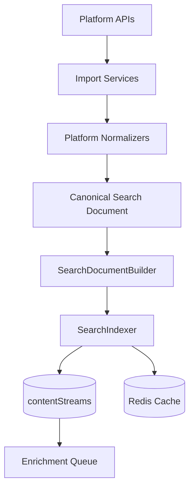

The indexing pipeline transforms raw platform API responses into searchable documents. Import services fetch content from platform APIs. Platform normalizers map raw responses to Canonical Search Documents. The SearchDocumentBuilder generates searchText and prepares the document for indexing. The SearchIndexer persists documents into contentStreams and populates Redis cache. Documents with incomplete metadata are enqueued for background enrichment.

### Query Pipeline

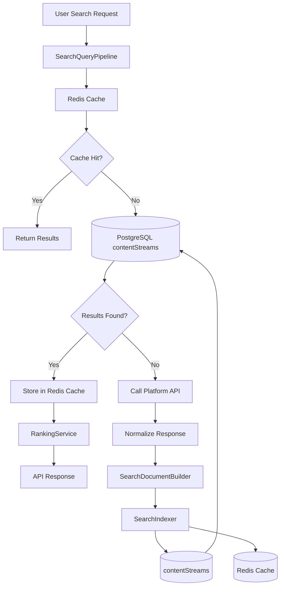

The query pipeline transforms a user search request into ranked results using a three-tier retrieval strategy. First, the SearchQueryPipeline checks Redis cache. If a cached response exists, it is returned immediately. If Redis misses, the SearchProvider searches contentStreams. If results are found, they are stored in Redis and returned. If PostgreSQL also misses, the system calls the appropriate platform API, normalizes the response, indexes it into contentStreams, populates Redis, then returns results.

---

## 6. Search Request Flow

### Three-Tier Retrieval Strategy

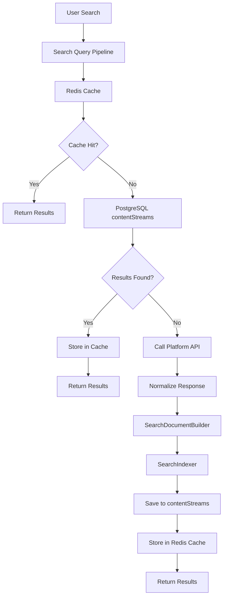

### Cache Hit Path (Redis)

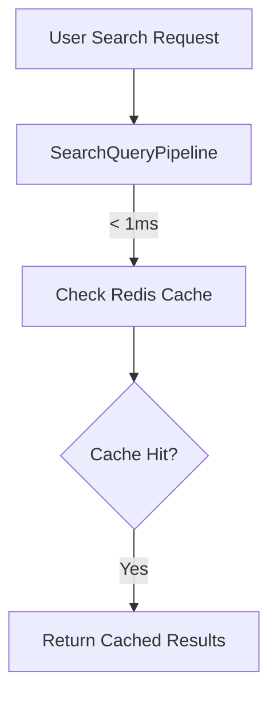

**Latency:** < 5ms total

The fastest path. If a cached response exists in Redis, it is returned immediately. No PostgreSQL query, no external API calls.

### Cache Miss Path (PostgreSQL)

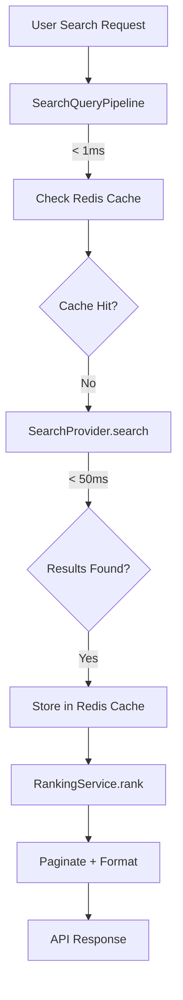

**Latency:** < 100ms total

When Redis misses, the system queries PostgreSQL contentStreams. If results exist, they are stored in Redis for future requests and returned to the user.

### Cache Miss Path (On-Demand Indexing)

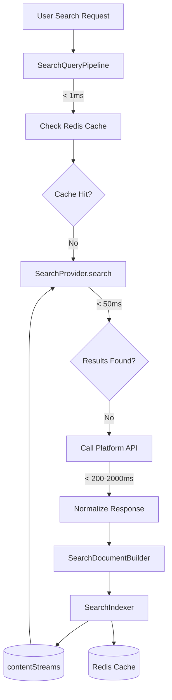

**Latency:** 200-2000ms (first search only)

When both Redis and PostgreSQL miss, the system calls the appropriate platform API (YouTube search.list, future: Facebook, Instagram, Pinterest), normalizes the response, indexes it into contentStreams, populates Redis, then searches again. This path has higher latency but ensures future searches for the same query are served from Redis (< 5ms).

> **Important**
>
> Cache miss API calls must be non-blocking. If the platform API is slow or unavailable, return partial results or an empty result set. Never block the entire search pipeline waiting for a single platform.

---

## 7. Infrastructure Constraints

| Component | Constraint | Impact |
|---|---|---|
| Cloud Run | 512 MB RAM | No additional search services in Phase 1 |
| Cloud Run | 0.1 vCPU | Prefer async indexing, avoid synchronous heavy computation |
| Redis | 30 MB | Cache only search responses, not entire indexes |
| Redis | 30 connections | Reuse existing shared client, no new connections |
| PostgreSQL | Source of truth | Search corpus stored in contentStreams |
| YouTube API | 100 `search.list` queries/day | On-demand indexing for cache miss only; never search live for indexed content |
| Cloudflare R2 | 10 GB | Media goes to R2, not container filesystem |
| BullMQ | Concurrency 1-2 per worker | Indexing must not block other background workers |

---

## 7.1 Benefits

| Benefit | Description |
|---|---|
| **Fastest search responses** | Redis cache provides sub-5ms response times for cached queries |
| **Reduced PostgreSQL load** | Redis absorbs repeated queries, reducing database load |
| **Reduced YouTube API usage** | Significantly reduces YouTube search.list calls by serving cached/indexed content |
| **Eliminated unnecessary API calls** | No API calls for content already in Redis or PostgreSQL |
| **Naturally fresh popular content** | Popular content is refreshed when searched and stale, keeping it naturally fresh |
| **Demand-driven indexing** | New content enters the search corpus through real user demand, not scheduled crawling |
| **Platform-agnostic architecture** | Supports future platforms without changing search architecture |
| **Low infrastructure costs** | No new infrastructure services required; uses existing PostgreSQL, Redis, and BullMQ |
| **Infrastructure-aware design** | Fits Cloud Run constraints (512 MB RAM / 0.1 vCPU) and Redis limits (30 MB / 30 connections) |

---

## 7.2 Example

**User A searches: "Next.js tutorial"**

1. Redis: MISS
2. PostgreSQL: MISS
3. YouTube `search.list` is called (on-demand indexing)
4. Results are normalized via YouTube Normalizer
5. Results are indexed into `contentStreams`
6. Results are stored in Redis cache
7. Results are returned to User A

**User B searches: "Next.js tutorial" (later)**

1. Redis: HIT
2. Return immediately
3. No PostgreSQL query
4. No YouTube API call
5. Sub-5ms latency

**If Redis expires...**

**User C searches: "Next.js tutorial"**

1. Redis: MISS
2. PostgreSQL: HIT (content still indexed)
3. Store in Redis cache
4. Return results
5. No platform API call

---

## 8. Core Architectural Principles

1. **Search is platform-independent.** The search engine knows nothing about YouTube, Facebook, or any specific platform. It only knows Canonical Search Documents.
2. **Three-tier retrieval (Redis → PostgreSQL → Platform API).** Every search checks Redis first, then PostgreSQL, then calls external APIs only if both miss.
3. **Redis is a performance cache.** Redis caches search responses for fast retrieval. PostgreSQL remains the source of truth.
4. **On-demand indexing.** New content enters the search corpus through real user demand (cache miss triggers indexing). This eliminates unnecessary API calls for unpopular content.
5. **Imports produce search documents.** Every content import triggers search document creation as part of the import pipeline.
6. **Lazy refresh, not scheduled polling.** Content is refreshed only when: (a) forceRefresh=true, (b) stale content is searched again, (c) content owner imports new data, or (d) manual administrative refresh. No weekly refresh schedules.
7. **Ranking is separate from retrieval.** The search engine returns candidates. Ranking is a separate service that can be upgraded independently.
8. **Search engine implementations are replaceable.** The SearchProvider interface abstracts PostgreSQL, Meilisearch, or any future engine. Callers do not change.
9. **All changes must be backward compatible.** The existing API contract is preserved throughout Phase 1. No frontend changes required.
10. **Infrastructure-aware design.** Every decision accounts for 512 MB RAM, 0.1 vCPU, and 30 Redis connections.
11. **Additive-only migrations.** No destructive schema changes. New columns are nullable. Old code continues to work.

---

## 9. Search Lifecycle

### Indexing Lifecycle

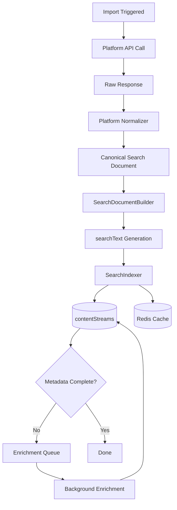

### Search Lifecycle (Redis Cache Hit)

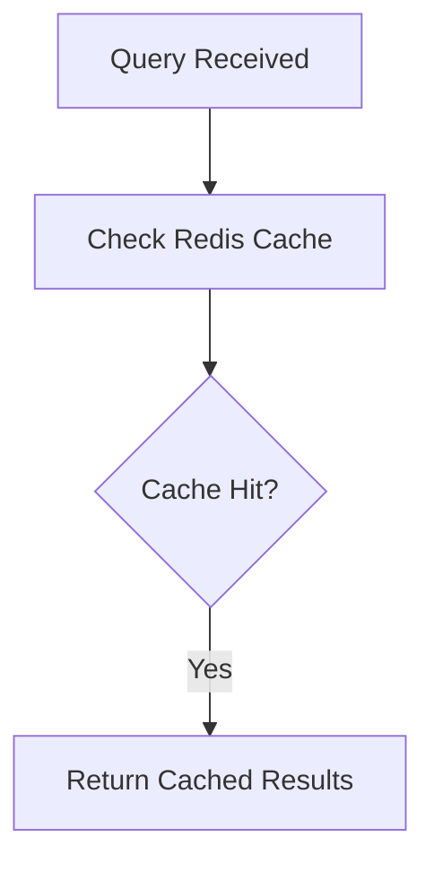

### Search Lifecycle (PostgreSQL Cache Hit)

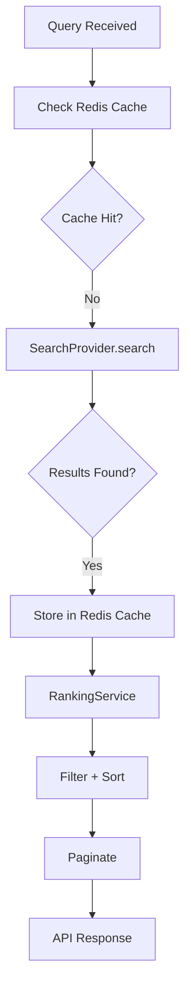

### Search Lifecycle (On-Demand Indexing)

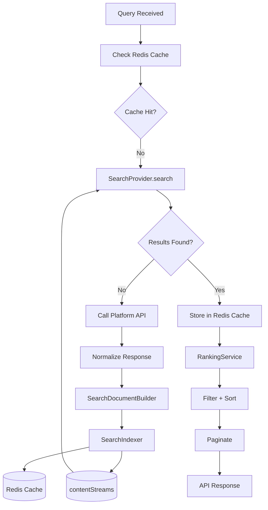

### Refresh Lifecycle (Lazy, On-Demand)

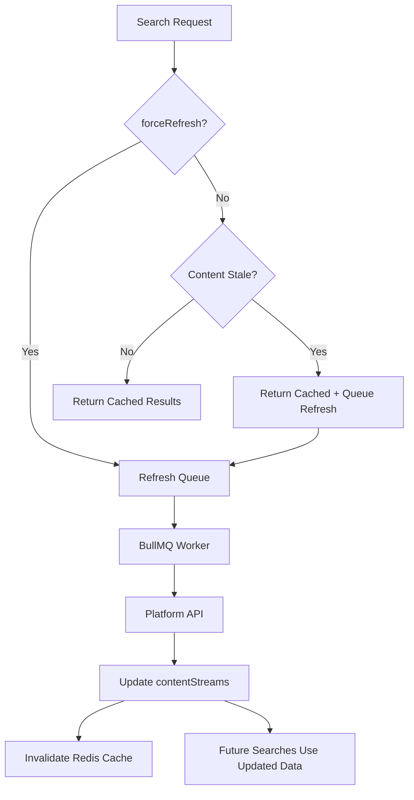

**Refresh triggers:**
- `forceRefresh=true` in search request
- Content exceeds freshness threshold AND is searched again
- Content owner performs a new import
- Manual administrative refresh

> **Important**
>
> Searching itself must never block waiting for refreshes. Stale results are returned immediately, and refresh happens asynchronously in the background.

---

## 10. Document Map

| Document | Purpose | Status | Depends On |
|---|---|---|---|
| [README](./README.md) | Entry point, architecture summary | ✅ Implemented | — |
| [00_Overview](./00_Overview.md) | Project overview, goals, constraints | ⚪ Planned | README |
| [01_Current_Search_Audit](./01_Current_Search_Audit.md) | Current search implementation audit | ⚪ Planned | README |
| [02_Architecture](./02_Architecture.md) | Complete architecture diagrams | ⚪ Planned | 00, 01 |
| [03_Search_Domain_Model](./03_Search_Domain_Model.md) | Canonical Search Document, Search Candidate, Search Result | ✅ Implemented | 02 |
| [04_Search_Query_Pipeline](./04_Search_Query_Pipeline.md) | Full query lifecycle | ✅ Implemented | 03 |
| [05_Search_Provider](./05_Search_Provider.md) | SearchProvider interface and implementations | ⚪ Planned | 03 |
| [06_Search_Indexer](./06_Search_Indexer.md) | Indexing mechanism | ⚪ Planned | 03, 05 |
| [07_Search_Document_Builder](./07_Search_Document_Builder.md) | searchText generation | ⚪ Planned | 03 |
| [08_Ranking_Engine](./08_Ranking_Engine.md) | Ranking formulas and configuration | ⚪ Planned | 03, 05 |
| [09_ContentStreams_Extension](./09_ContentStreams_Extension.md) | Column audit, migration, indexes | ⚪ Planned | 03, 06 |
| [10_Postgres_Search](./10_Postgres_Search.md) | FTS, pg_trgm, GIN, performance | ⚪ Planned | 05, 09 |
| [11_YouTube_Normalizer](./11_YouTube_Normalizer.md) | YouTube API mapping and normalization | ⚪ Planned | 03, 07 |
| [12_YouTube_Import_Pipeline](./12_YouTube_Import_Pipeline.md) | YouTube import lifecycle | ⚪ Planned | 06, 11 |
| [13_Background_Enrichment](./13_Background_Enrichment.md) | videos.list enrichment, quota, batching | ⚪ Planned | 06, 12 |
| [14_Background_Refresh](./14_Background_Refresh.md) | Staleness detection, refresh scheduling | ⚪ Planned | 06 |
| [15_Search_API_Refactor](./15_Search_API_Refactor.md) | API contract preservation, feature flag | ✅ Implemented | 04, 05 |
| [16_Feature_Flag_Rollout](./16_Feature_Flag_Rollout.md) | Deployment, rollback, monitoring | ✅ Resolved (flag removed) | 15 |
| [17_Testing_Strategy](./17_Testing_Strategy.md) | Unit, integration, E2E, load testing | ⚪ Planned | 06, 15 |
| [18_Migration_Plan](./18_Migration_Plan.md) | Migration order, backfill, zero downtime | ⚪ Planned | 09 |
| [19_Rollback_Strategy](./19_Rollback_Strategy.md) | Rollback procedures and recovery | ⚪ Planned | 18 |
| [20_Facebook_Implementation](./20_Facebook_Implementation.md) | Facebook-specific normalization | ⚪ Planned | 11 |
| [21_Instagram_Implementation](./21_Instagram_Implementation.md) | Instagram-specific normalization | ⚪ Planned | 11 |
| [22_Pinterest_Implementation](./22_Pinterest_Implementation.md) | Pinterest-specific normalization | ⚪ Planned | 11 |
| [23_Future_AI_Search](./23_Future_AI_Search.md) | Vision, OCR, embeddings, semantic search | ⚪ Planned | 02 |
| [24_Meilisearch_Migration](./24_Meilisearch_Migration.md) | When and how to migrate | ⚪ Planned | 05 |
| [25_Search_Governance](./25_Search_Governance.md) | Long-term contracts for platform integrations | ⚪ Planned | All |
| [IMPLEMENTATION_CHECKLIST](./IMPLEMENTATION_CHECKLIST.md) | Living implementation checklist | ⚪ Planned | All |

---

## 11. Reading Order

### Architects

1. [README](./README.md)
2. [00_Overview](./00_Overview.md)
3. [01_Current_Search_Audit](./01_Current_Search_Audit.md)
4. [02_Architecture](./02_Architecture.md)
5. [03_Search_Domain_Model](./03_Search_Domain_Model.md)
6. [04_Search_Query_Pipeline](./04_Search_Query_Pipeline.md)
7. [05_Search_Provider](./05_Search_Provider.md)
8. [08_Ranking_Engine](./08_Ranking_Engine.md)
9. [25_Search_Governance](./25_Search_Governance.md)

### Backend Developers

1. [README](./README.md)
2. [03_Search_Domain_Model](./03_Search_Domain_Model.md)
3. [05_Search_Provider](./05_Search_Provider.md)
4. [06_Search_Indexer](./06_Search_Indexer.md)
5. [07_Search_Document_Builder](./07_Search_Document_Builder.md)
6. [09_ContentStreams_Extension](./09_ContentStreams_Extension.md)
7. [10_Postgres_Search](./10_Postgres_Search.md)
8. [11_YouTube_Normalizer](./11_YouTube_Normalizer.md)
9. [12_YouTube_Import_Pipeline](./12_YouTube_Import_Pipeline.md)
10. [13_Background_Enrichment](./13_Background_Enrichment.md)
11. [14_Background_Refresh](./14_Background_Refresh.md)
12. [15_Search_API_Refactor](./15_Search_API_Refactor.md)

### Frontend Developers

1. [README](./README.md)
2. [15_Search_API_Refactor](./15_Search_API_Refactor.md)
3. [17_Testing_Strategy](./17_Testing_Strategy.md)

---

## 12. Current Status

| Component | Status | Owner |
|---|---|---|
| Architecture Definition | ✅ Implemented | Architect |
| Search Domain Model | ✅ Implemented | Architect |
| Search Provider | ✅ Implemented | Backend |
| Search Indexer | 🟡 In Progress | Backend |
| SearchDocumentBuilder | 🟡 In Progress | Backend |
| Ranking Service | ✅ Implemented | Backend |
| contentStreams Extension | ✅ Implemented | Database |
| PostgreSQL Search | ✅ Implemented | Database |
| YouTube Normalizer | 🟡 In Progress | Backend |
| YouTube Import Pipeline | 🟡 In Progress | Backend |
| Background Enrichment | 🟡 In Progress | Backend |
| Background Refresh | 🟡 In Progress | Backend |
| Search API Refactor | ✅ Implemented | Backend |
| Feature Flag | ✅ Resolved (removed) | Backend |
| Testing | 🟡 In Progress | QA |
| Facebook | ⚪ Planned | Backend |
| Instagram | ⚪ Planned | Backend |
| Pinterest | ⚪ Planned | Backend |
| Meilisearch | ⚪ Planned | Backend |

---

## 13. Existing Code References

| Component | Entity | Repository | Service | Migration | Owner |
|---|---|---|---|---|---|
| contentStreams | `contentStream.entity.ts` | `contentStream.repository.ts` | `search.service.ts` | `1753703662899` | Database |
| userContents | `userContent.entity.ts` | `userContent.repository.ts` | `youtube-imports.service.ts` | `1748003280923` | Backend |
| userContents (identity index) | `userContent.entity.ts` | `userContent.repository.ts` | — | `1785455366000` | Database |
| linkedAccounts | `linkedAccount.entity.ts` | `linkedAccount.repository.ts` | `platform-disconnect.service.ts` | `1747656498189` | Backend |
| SearchService | — | — | `search.service.ts` (3,151 lines) | — | Backend |
| SearchCacheService | — | — | `searchCache.service.ts` | — | Redis |
| Search Endpoint | — | — | `search.endpoint.ts` | — | Backend |
| Search History | `searchHistroy.entity.ts` | `searchHistory.repository.ts` | — | `1757599900379` | Backend |
| General Repository | — | `general.repository.ts` | — | — | Database |
| YouTube Analytics | `youtubeAnalytic.entity.ts` | `youtubeAnalytic.repository.ts` | `youtubeAnalytics.service.ts` | `1782241531692` | Backend |

---

## 14. Key Decisions

> **Decision**
>
> `contentStreams` will serve as the canonical search corpus. No new search tables will be created.

> **Decision**
>
> PostgreSQL is the initial search engine. Meilisearch migration is planned but not implemented.

> **Decision**
>
> `SearchProvider` abstracts the search implementation. PostgreSQL today, Meilisearch tomorrow, without caller changes.

> **Decision**
>
> **Three-tier retrieval (Redis → PostgreSQL → Platform API).** Every search checks Redis first, then PostgreSQL, then calls external APIs only if both miss.

> **Decision**
>
> **Redis is a performance cache.** Redis caches search responses for fast retrieval. PostgreSQL remains the source of truth for search. If Redis is empty, PostgreSQL remains the source of truth.

> **Decision**
>
> **Cache population rules.** Redis caches: search results, frequently searched queries, trending searches, popular filters. Redis does NOT cache: entire platform datasets, full indexes, large metadata blobs.

> **Decision**
>
> **On-demand indexing.** New content enters the search corpus through real user demand. Cache miss triggers platform API call, normalization, and indexing. This eliminates unnecessary API calls for unpopular content.

> **Decision**
>
> **Lazy refresh, not scheduled polling.** Content is refreshed only when: (a) forceRefresh=true, (b) stale content is searched again, (c) content owner imports new data, or (d) manual administrative refresh. No weekly or periodic refresh schedules.

> **Decision**
>
> Ranking is independent of retrieval. The search engine returns candidates. Ranking is a separate service.

> **Decision**
>
> All platform integrations normalize into a Canonical Search Document. No platform-specific search logic.

> **Decision**
>
> AI enrichment is deferred but designed for. The searchText field and metadata JSONB column accommodate future embeddings and semantic vectors.

> **Decision**
>
> Meilisearch migration is planned, not implemented. The SearchProvider interface makes it a drop-in replacement.

---

## 15. Design Principles

1. **Single Responsibility** — Each component does one thing. Normalizers normalize. Builders build. Indexers index. Rankers rank.
2. **Three-Tier Retrieval** — Redis → PostgreSQL → Platform API. Fastest path first.
3. **Redis as Performance Cache** — Redis caches search responses for sub-5ms retrieval. PostgreSQL remains source of truth.
4. **On-Demand Indexing** — New content enters the corpus through real user demand. No unnecessary API calls for unpopular content.
5. **Lazy Refresh** — Content is refreshed only when searched and stale. No scheduled polling or periodic API synchronization.
6. **Incremental Migrations** — All schema changes are additive. New columns are nullable. Old code continues to work.
7. **Idempotent Indexing** — Indexing the same document twice produces the same result. No duplicates, no conflicts.
8. **Feature Flags** — New search implementation runs behind a feature flag. Old and new coexist during rollout.
9. **Backward Compatibility** — The existing API contract is preserved. Frontend requires no changes.
10. **Infrastructure-Aware Design** — Every decision accounts for 512 MB RAM, 0.1 vCPU, and 30 Redis connections.

---

## 16. Terminology

| Term | Definition |
|---|---|
| **Canonical Search Document** | The normalized, platform-independent representation of searchable content. Maps to a contentStreams row. |
| **Search Corpus** | The total collection of indexed documents in contentStreams. |
| **Platform Normalizer** | Component that maps platform-specific API responses to Canonical Search Documents. |
| **Search Document Builder** | Component that generates searchText, cleans text, and prepares documents for indexing. |
| **Search Provider** | Abstract interface for search engine implementations (PostgreSQL, Meilisearch). |
| **Search Indexer** | Component that persists Search Documents into the search corpus (contentStreams) and Redis cache. |
| **Search Candidate** | A result returned by SearchProvider before ranking. |
| **Search Query Pipeline** | The full lifecycle from user query to ranked results, including Redis cache lookup. |
| **Ranking Engine** | Component that scores and orders Search Candidates based on text relevance, engagement, freshness, and creator authority. |
| **Background Enrichment** | Process that adds detailed metadata (view counts, duration, tags) to indexed documents after initial import. |
| **Background Refresh** | Process that updates stale documents with fresh data from platform APIs. Triggered lazily, not on a schedule. |
| **Cache Hit (Redis)** | A search query that finds a matching response in Redis cache, returning immediately without querying PostgreSQL. |
| **Cache Hit (PostgreSQL)** | A search query that finds matching content in contentStreams, storing the result in Redis before returning. |
| **Cache Miss** | A search query that finds no matching content in either Redis or PostgreSQL, triggering on-demand indexing. |
| **On-Demand Indexing** | The process of fetching content from a platform API when a cache miss occurs, normalizing it, and indexing it into contentStreams. |
| **Lazy Refresh** | A refresh strategy where content is only refreshed when searched and stale, not on a periodic schedule. |

---

## Future Considerations

- Semantic search with embeddings and vector similarity
- AI-powered ranking with machine learning models
- Real-time webhook-triggered indexing for live content
- Personalized search based on user behavior and preferences
- Multi-language tokenization and search
- Image OCR for visual content search
- Speech transcription for video/audio content search
- Recommendation engine based on search patterns

---

## Related Documents

- [00_Overview](./00_Overview.md)
- [01_Current_Search_Audit](./01_Current_Search_Audit.md)
- [02_Architecture](./02_Architecture.md)
- [03_Search_Domain_Model](./03_Search_Domain_Model.md)
- [25_Search_Governance](./25_Search_Governance.md)
- [IMPLEMENTATION_CHECKLIST](./IMPLEMENTATION_CHECKLIST.md)
